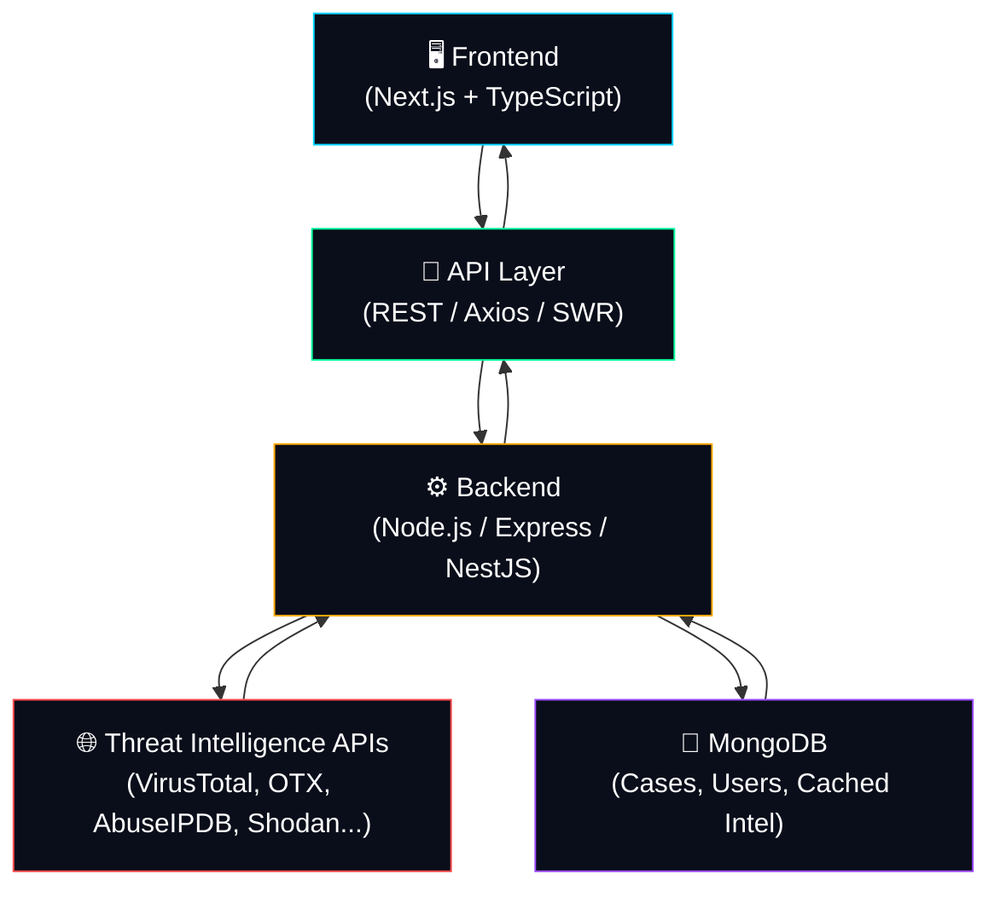

<div align="center">

# 🛡️ SentinelX AI Frontend

### AI-Powered Cybersecurity Platform for Threat Intelligence, IOC Investigation, Malware Analysis, Vulnerability Intelligence & Security Operations

<p>
  <strong>Enterprise-grade security tooling for SOC teams, threat hunters, and blue teams — built on a modern, blazing-fast frontend stack.</strong>
</p>

[](#)
[](#)
[](#)
[](#)
[](#)
[](#license)

[](#)
[](#)
[](#)
[](#)
[](#)
[](#)

<br/>


<br/><br/>

**[🚀 Live Demo](#)** • **[📖 Documentation](#)** • **[🐛 Report Bug](#)** • **[✨ Request Feature](#)**

</div>

---

## 📚 Table of Contents

- [Overview](#-overview)
- [Features](#-features)
- [Screenshots](#-screenshots)
- [Architecture](#-architecture)
- [Technology Stack](#-technology-stack)
- [Folder Structure](#-folder-structure)
- [Installation](#-installation)
- [Environment Variables](#-environment-variables)
- [Available Pages](#-available-pages)
- [Component Architecture](#-component-architecture)
- [Security Features](#-security-features)
- [Performance](#-performance)
- [Accessibility](#-accessibility)
- [Responsive Design](#-responsive-design)
- [Animations](#-animations)
- [API Integration](#-api-integration)
- [State Management](#-state-management)
- [Error Handling](#-error-handling)
- [Deployment](#-deployment)
- [Production Checklist](#-production-checklist)
- [Roadmap](#-roadmap)
- [Contributing](#-contributing)
- [Code Style](#-code-style)
- [License](#-license)
- [Author](#-author)
- [Support](#-support)

---

## 🧠 Overview

**SentinelX AI** is a next-generation, AI-augmented cybersecurity intelligence platform designed to unify **threat intelligence**, **IOC investigation**, **malware analysis**, and **vulnerability intelligence** into a single, elegant operational interface.

Modern security teams juggle a dozen disconnected tools — VirusTotal in one tab, AbuseIPDB in another, Shodan somewhere else — losing time and context switching between platforms during time-critical investigations. **SentinelX AI solves this** by aggregating multiple threat intelligence providers behind a single AI-assisted interface, giving analysts a unified verdict, timeline, and actionable context in seconds instead of minutes.

> 💡 **Mission:** Reduce Mean-Time-To-Investigate (MTTI) by giving analysts a single pane of glass powered by AI correlation, not tab-hopping.

### 🎯 Problems Solved

- ❌ Fragmented threat intel workflows across many vendor dashboards
- ❌ Manual correlation of IOC data from multiple sources
- ❌ Slow, non-standardized malware/URL/hash triage
- ❌ Lack of unified security posture visibility
- ❌ No AI-assisted verdicting on ambiguous indicators

### 👥 Target Users

| Persona | Use Case |
|---|---|
| 🧑‍💻 **SOC Analysts** | Rapid IOC triage during alert investigation |
| 🛡️ **Blue Teams** | Continuous monitoring & defensive posture management |
| ⚙️ **Security Engineers** | Building detection pipelines around unified intel |
| 🚨 **Incident Responders** | Fast contextual lookups during active incidents |
| 🕵️ **Threat Hunters** | Proactive campaign & APT correlation |
| 🎓 **Students** | Learning practical threat intelligence workflows |
| 🔬 **Researchers** | Aggregated data for malware/threat research |

---

## ✨ Features

### 🌐 Threat Intelligence
- 🔴 **Global Threat Feed** — real-time aggregated feed of emerging threats
- 🎯 **IOC Intelligence** — deep-dive lookups on IPs, domains, hashes, URLs
- 🦠 **Malware Analysis** — static/dynamic verdicts from multi-engine scanning
- ⭐ **Threat Reputation** — composite reputation scoring across providers
- 🤖 **AI Verdict** — LLM-generated risk summary and recommended action
- 📈 **Threat Timeline** — chronological visualization of indicator activity

### 🔍 Security Scanner
- 📁 **File Scanner** — multi-engine malware detection for uploaded files
- 🔗 **URL Scanner** — phishing & malicious URL detection
- 🌍 **IP Scanner** — geolocation, ASN, and abuse reputation lookups
- #️⃣ **Hash Scanner** — MD5 / SHA1 / SHA256 reputation lookups

### 🧬 IOC (Indicators of Compromise)
- 📇 **WHOIS** — domain registration intelligence
- 🌐 **DNS** — record resolution & history
- ⭐ **Reputation** — cross-provider scoring
- 🤖 **AI Analysis** — contextual AI-generated explanation
- 🔎 **Global Lookup** — unified search across all providers

### 🏛️ Threat Center
- 🦠 **Malware** — searchable malware family database
- 🐛 **CVEs** — vulnerability intelligence & CVSS scoring
- 🎭 **APT Groups** — threat actor profiles & TTPs
- 🗺️ **Threat Map** — live global attack visualization
- 📡 **Threat Feed** — curated, categorized intelligence stream

### 📊 Dashboard
- 💯 **Security Score** — composite organizational risk score
- 📡 **Live Widgets** — real-time updating data panels
- 📈 **Statistics** — trends across scans, alerts, and cases
- 🚨 **Alerts** — prioritized, actionable notifications
- 🗂️ **Cases** — investigation case management

### 📄 Reports
- 📕 **Export PDF** — formatted investigation reports
- 📊 **CSV** — raw data export for spreadsheets
- 🧾 **JSON** — structured export for automation pipelines

---

## 🖼 Screenshots

<div align="center">

| Dashboard | Threat Center |
|---|---|
|  |  |

| IOC Investigation | Security Scanner |
|---|---|
|  |  |

| Settings | Integrations |
|---|---|
|  |  |

| Profile | Reports |
|---|---|
|  |  |

</div>

---

## 🏗 Architecture



> The frontend never talks directly to third-party threat intel providers — all provider requests are proxied and cached through the backend to protect API keys and enforce rate limiting.

---

## 🛠 Technology Stack

| Category | Technology |
|---|---|
| **Framework** | Next.js 14 (App Router) |
| **Language** | TypeScript |
| **State Management** | Zustand + React Query (TanStack Query) |
| **Animations** | Framer Motion |
| **Icons** | Lucide React |
| **Charts** | Recharts / D3.js |
| **Maps** | React Simple Maps / Leaflet |
| **UI** | TailwindCSS + shadcn/ui + Radix Primitives |
| **Authentication** | JWT + NextAuth.js |
| **HTTP Client** | Axios |
| **Build Tool** | Vite / Turbopack |
| **Deployment** | Vercel / Docker |

---

## 📁 Folder Structure

```
sentinelx-ai-frontend/
├── src/
│   ├── app/                    # Next.js App Router pages
│   │   ├── dashboard/          # Dashboard route
│   │   ├── ioc/                # IOC investigation module
│   │   ├── threat-center/      # Threat center (CVEs, APTs, malware)
│   │   ├── scanner/            # File/URL/IP/Hash scanner
│   │   ├── reports/            # Report generation & export
│   │   ├── settings/           # User & org settings
│   │   └── layout.tsx          # Root layout
│   │
│   ├── components/
│   │   ├── ui/                 # Base UI primitives (Button, Card, Input)
│   │   ├── widgets/             # Dashboard widgets (StatCard, LiveFeed)
│   │   ├── charts/              # Chart components (Recharts wrappers)
│   │   └── layout/               # Navbar, Sidebar, Shell
│   │
│   ├── lib/
│   │   ├── api/                 # API client & provider wrappers
│   │   ├── auth/                 # Auth utilities & guards
│   │   └── utils/                 # Helper functions
│   │
│   ├── store/                    # Zustand state stores
│   ├── hooks/                    # Custom React hooks
│   ├── types/                    # TypeScript type definitions
│   └── styles/                   # Global Tailwind styles
│
├── public/                       # Static assets
├── .env.example                  # Environment variable template
├── next.config.js
├── tailwind.config.ts
├── tsconfig.json
└── package.json
```

**Folder purpose:**

- `app/` — route-based pages using Next.js App Router
- `components/ui/` — atomic, reusable design-system primitives
- `components/widgets/` — composite dashboard widgets built from `ui/`
- `lib/api/` — typed API layer abstracting all backend calls
- `store/` — global client state (auth, theme, filters)
- `hooks/` — encapsulated reusable logic (`useDebounce`, `useIOC`, etc.)

---

## ⚡ Installation

### 1️⃣ Clone the repository

```bash
git clone https://github.com/sentinelx-ai/frontend.git
cd frontend
```

### 2️⃣ Install dependencies

```bash
npm install
# or
pnpm install
```

### 3️⃣ Configure environment

```bash
cp .env.example .env.local
```

### 4️⃣ Run the development server

```bash
npm run dev
```

Visit **`http://localhost:3000`** 🎉

### 5️⃣ Build for production

```bash
npm run build
```

### 6️⃣ Lint the codebase

```bash
npm run lint
```

### 7️⃣ Start production server

```bash
npm run start
```

---

## 🔐 Environment Variables

> ⚠️ **Never commit `.env.local` or expose real API keys.** All secrets are consumed server-side by the backend, not the frontend.

```env
# API Configuration
VITE_API_URL=https://api.sentinelx.ai/v1
VITE_APP_NAME=SentinelX AI

# App Settings
VITE_APP_ENV=production
VITE_ENABLE_ANALYTICS=true

# Authentication
VITE_AUTH_DOMAIN=auth.sentinelx.ai
VITE_JWT_STORAGE_KEY=sx_token

# Feature Flags
VITE_ENABLE_AI_VERDICT=true
VITE_ENABLE_THREAT_MAP=true
```

| Variable | Description |
|---|---|
| `VITE_API_URL` | Base URL for the backend API layer |
| `VITE_APP_NAME` | Display name used across the UI |
| `VITE_APP_ENV` | Current environment (`development`/`staging`/`production`) |
| `VITE_ENABLE_ANALYTICS` | Toggles analytics tracking |
| `VITE_AUTH_DOMAIN` | Domain used for auth redirects |
| `VITE_JWT_STORAGE_KEY` | LocalStorage key for session token |
| `VITE_ENABLE_AI_VERDICT` | Feature flag for AI verdicting module |
| `VITE_ENABLE_THREAT_MAP` | Feature flag for live threat map widget |

---

## 🧭 Available Pages

| Page | Route | Description |
|---|---|---|
| 📊 Dashboard | `/dashboard` | Security posture overview & live widgets |
| 🧬 IOC | `/ioc` | Indicator of compromise investigation |
| 🏛 Threat Center | `/threat-center` | Malware, CVEs, APT groups, threat map |
| 🔍 Scanner | `/scanner` | File, URL, IP, and hash scanning |
| 📄 Reports | `/reports` | Generate and export investigation reports |
| 🗂 Assets | `/assets` | Organizational asset inventory |
| 🚨 Alerts | `/alerts` | Prioritized security alerts |
| 🧯 Incidents | `/incidents` | Incident tracking & response |
| 👤 Profile | `/profile` | User profile management |
| ⚙️ Settings | `/settings` | Application & org preferences |
| 🔌 Integrations | `/integrations` | Third-party provider connections |
| 🔑 API Keys | `/api-keys` | Manage personal/org API credentials |

---

## 🧩 Component Architecture

SentinelX AI follows a **layered, atomic component design**:

- **Cards** — base container components (`<Card />`, `<GlassCard />`) for consistent elevation & radius
- **Buttons** — variant-driven (`primary`, `ghost`, `danger`) with loading/disabled states
- **Provider Cards** — display connected threat intel providers with health status
- **DataGrid** — sortable, filterable, paginated data tables for IOC/scan results
- **Stat Cards** — compact KPI displays used across the dashboard
- **Charts** — reusable Recharts wrappers (`<LineChart />`, `<RadarChart />`, `<Heatmap />`)
- **Widgets** — composite dashboard blocks combining cards + charts + live data

All components are strongly typed, themeable via CSS variables, and built to be composable across pages.

---

## 🔒 Security Features

- 🔑 **JWT Authentication** — short-lived access tokens with refresh rotation
- 🛡️ **Protected Routes** — route guards redirect unauthenticated users
- 🔌 **API Layer Abstraction** — all requests routed through a typed, centralized client (no direct third-party calls from the browser)
- 👥 **Role-Based UI** — conditional rendering based on user roles (Admin, Analyst, Viewer)
- ✅ **Input Validation** — schema validation via Zod on every form
- 🚫 **XSS Protection** — sanitized rendering, no `dangerouslySetInnerHTML` without sanitization
- 🔐 **CSRF Mitigation** — same-site cookies & token-based request verification

---

## ⚙️ Performance

- 🌀 **Lazy Loading** — route-level and component-level code splitting
- 📦 **Dynamic Imports** — heavy modules (charts, maps) loaded on demand
- ✂️ **Code Splitting** — automatic per-route bundle splitting via Next.js
- 🗄️ **Caching** — React Query cache with stale-while-revalidate strategy
- 🧠 **Memoization** — `useMemo` / `React.memo` for expensive computations
- 📜 **Virtualization** — windowed rendering for large IOC/data tables

---

## ♿ Accessibility

- ⌨️ Full **keyboard navigation** support across all interactive elements
- 🏷️ **ARIA** labels and roles on custom components
- 🎨 **WCAG AA contrast** compliance across dark/light themes
- 📱 Fully **responsive** layouts tested down to 320px width

---

## 📱 Responsive Design

| Breakpoint | Target |
|---|---|
| 🖥️ Desktop | ≥ 1280px — full sidebar, multi-column dashboard |
| 📟 Tablet | 768px–1279px — collapsible sidebar, stacked widgets |
| 📱 Mobile | < 768px — bottom nav, single-column layout |

---

## 🎬 Animations

- 🎞️ **Framer Motion** page transitions and micro-interactions
- ⏳ **Loading States** with animated progress indicators
- 💀 **Skeletons** for perceived-performance during data fetch
- 🔄 **Transitions** between route/page changes
- ✨ **Hover Effects** on cards, buttons, and interactive rows

---

## 🔗 API Integration

SentinelX AI aggregates threat intelligence from the following providers — **all consumed via the backend**, never called directly from the frontend to protect credentials and enforce caching/rate-limits:

| Provider | Purpose |
|---|---|
| 🦠 **VirusTotal** | Multi-engine file/URL/hash scanning |
| 📡 **AlienVault OTX** | Open threat exchange intelligence |
| 🚫 **AbuseIPDB** | IP abuse reporting & reputation |
| 🔕 **GreyNoise** | Internet background noise classification |
| 🌐 **Google Safe Browsing** | Malicious URL detection |
| 🦊 **ThreatFox** | IOC sharing platform (abuse.ch) |
| 🧫 **MalwareBazaar** | Malware sample database (abuse.ch) |
| 🔎 **URLScan.io** | URL sandboxing & screenshotting |
| 🌊 **Pulsedive** | Threat intelligence enrichment |
| 🛰️ **Shodan** | Internet-connected device intelligence |
| 🇰🇷 **CriminalIP** | IP/domain risk intelligence |
| ℹ️ **IPinfo** | IP geolocation & ASN data |

> All provider responses are normalized into a unified SentinelX schema before reaching the frontend, ensuring consistent UI rendering regardless of source.

---

## 🗃 State Management

- **Zustand** manages global client state (auth session, theme, active filters, UI preferences)
- **React Query (TanStack Query)** manages all server state — fetching, caching, background refetching
- **Caching** — configurable stale time per query key, with manual invalidation on mutation
- **Loading** — standardized `isLoading` / `isFetching` states drive skeleton UI
- **Error Handling** — centralized `onError` handlers feed into the global toast system

---

## 🧯 Error Handling

- 🔁 **Retry** — automatic exponential-backoff retries on failed network requests
- 🩹 **Fallback UI** — graceful degraded states when data is unavailable
- 🍞 **Toast Notifications** — non-blocking error/success/warning alerts
- 💀 **Skeleton Loaders** — prevent layout shift during fetch/error states
- 🧱 **Error Boundaries** — component-level boundaries prevent full-app crashes

---

## 🚀 Deployment

<table>
<tr><td>

**▲ Vercel**
```bash
vercel --prod
```

</td><td>

**🌐 Netlify**
```bash
netlify deploy --prod
```

</td></tr>
<tr><td>

**🐳 Docker**
```bash
docker build -t sentinelx-ai-frontend .
docker run -p 3000:3000 sentinelx-ai-frontend
```

</td><td>

**☁️ Render**
```bash
# Build Command
npm run build

# Start Command
npm run start
```

</td></tr>
</table>

---

## ✅ Production Checklist

- [ ] Environment variables configured for production
- [ ] API rate limiting verified on backend
- [ ] Error boundaries added to all top-level routes
- [ ] Lighthouse performance score ≥ 90
- [ ] Accessibility audit passed (axe / WCAG AA)
- [ ] All secrets excluded from client bundle
- [ ] SEO metadata & Open Graph tags configured
- [ ] Analytics & error monitoring (Sentry) wired up
- [ ] Responsive QA across mobile/tablet/desktop
- [ ] CI/CD pipeline green on `main`

---

## 🗺 Roadmap

- [ ] 🤖 AI-powered automated incident summarization
- [ ] 🔗 SOAR platform integrations (Splunk, QRadar)
- [ ] 🌙 Custom theme builder
- [ ] 📱 Native mobile companion app
- [ ] 🧩 Browser extension for inline IOC lookups
- [ ] 🗣️ Multi-language (i18n) support
- [ ] 📊 Custom dashboard builder (drag-and-drop widgets)
- [ ] 🔔 Slack/Teams alert integrations

---

## 🤝 Contributing

Contributions are welcome and appreciated! 🎉

1. **Fork** the repository
2. **Create** your feature branch: `git checkout -b feature/amazing-feature`
3. **Commit** your changes: `git commit -m "feat: add amazing feature"`
4. **Push** to the branch: `git push origin feature/amazing-feature`
5. **Open** a Pull Request

Please read `CONTRIBUTING.md` (coming soon) for our code of conduct and PR process before submitting.

---

## 🎨 Code Style

- **ESLint** — enforced linting rules for consistent code quality
- **Prettier** — automatic code formatting on save/commit
- **TypeScript** — strict mode enabled across the entire codebase

```bash
npm run lint       # Run ESLint
npm run format     # Run Prettier
npm run type-check # Run TypeScript compiler checks
```

---

## 📄 License

This project is licensed under the **MIT License** — see the [LICENSE](./LICENSE) file for details.

---

## 👤 Author

**SentinelX AI Team**

- GitHub: [@sentinelx-ai](https://github.com/sentinelx-ai)
- LinkedIn: [SentinelX AI](https://linkedin.com/company/sentinelx-ai)
- Portfolio: [sentinelx.ai](https://sentinelx.ai)

---

## 💬 Support

- 📧 Email: **support@sentinelx.ai**
- 🐛 [Open an Issue](https://github.com/sentinelx-ai/frontend/issues)
- 💬 [Join Discussions](https://github.com/sentinelx-ai/frontend/discussions)

---

<div align="center">

**Made with ❤️ by the SentinelX AI Team**

⭐ **If you find this project useful, consider giving it a star!** ⭐

</div>
