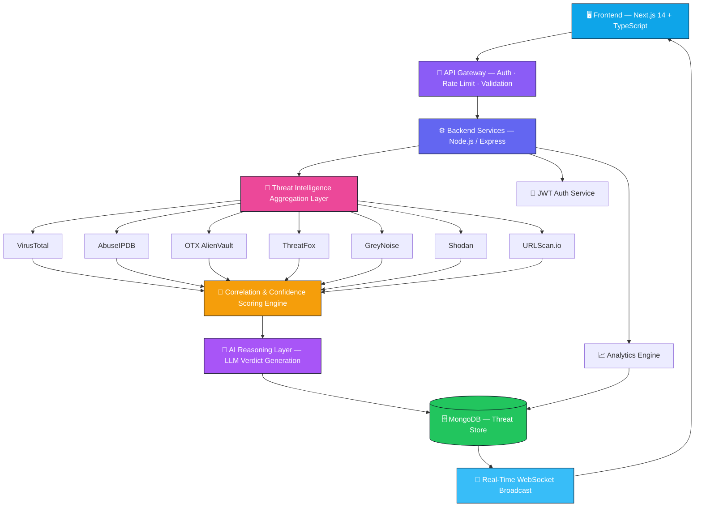
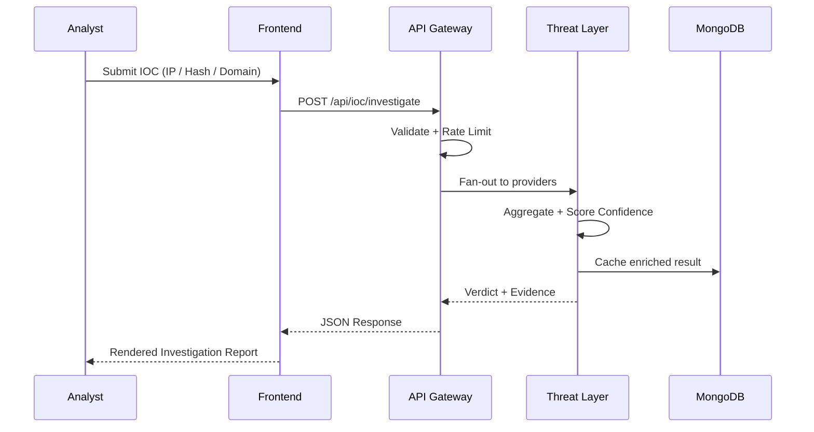
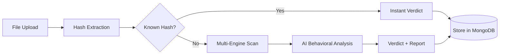
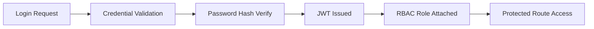

<div align="center">


<br/>

[](https://git.io/typing-svg)

<br/>

<p>
  
  
  
  
</p>
<p>
  
  
  
  
</p>
<p>
  
  
  
  
</p>
<p>
  
  
  
</p>

<br/>

<p>
  <a href="#-overview"><b>Overview</b></a> •
  <a href="#-features"><b>Features</b></a> •
  <a href="#-architecture"><b>Architecture</b></a> •
  <a href="#-tech-stack"><b>Tech Stack</b></a> •
  <a href="#-installation"><b>Installation</b></a> •
  <a href="#-api-integrations"><b>Integrations</b></a> •
  <a href="#-roadmap"><b>Roadmap</b></a>
</p>

</div>

<br/>

<div align="center">

</div>

<br/>

## 🌌 Overview

> **SentinelX AI** is a next-generation, AI-augmented Security Operations Center (SOC) platform built to give analysts the speed of automation with the precision of human judgment. It unifies threat intelligence, IOC investigation, malware detection, and security analytics into a single glass-cockpit interface — engineered for real-world SOC workflows, not just demos.

Built for **defenders who move at the speed of attackers.**

<div align="center">

| 🎯 Mission | ⚡ Speed | 🔒 Trust |
|:---:|:---:|:---:|
| Democratize enterprise-grade threat intel | Sub-second IOC correlation | Zero-trust architecture end-to-end |

</div>

<br/>

<div align="center">

</div>

## 🖥️ Preview

<div align="center">


<br/><br/>

<table>
<tr>
<td width="33%"></td>
<td width="33%"></td>
<td width="33%"></td>
</tr>
<tr>
<td align="center"><sub><b>IOC Investigation Console</b></sub></td>
<td align="center"><sub><b>Live Global Threat Map</b></sub></td>
<td align="center"><sub><b>AI Malware Scanner</b></sub></td>
</tr>
</table>

</div>

<br/>

## ✨ Features

<table>
<tr>
<td width="50%" valign="top">

### 🛡️ Threat Intelligence Engine
Aggregates real-time indicators from 10+ global feeds, deduplicates and enriches them, and scores confidence using a weighted AI model — giving analysts a single verified truth source instead of ten disconnected tabs.

</td>
<td width="50%" valign="top">

### ✨ IOC Investigation
Search any IP, domain, hash, or URL and get instant reputation, geolocation, WHOIS, passive DNS, and malware association — cross-referenced across every connected provider in one query.

</td>
</tr>
<tr>
<td width="50%" valign="top">

### 🌍 Global Threat Feed
A continuously updating stream of emerging campaigns, CVEs, and malware families, visualized on an interactive world map with severity-based clustering and live attack vectors.

</td>
<td width="50%" valign="top">

### ⚡ AI-Powered Detection
An LLM-backed classification layer that explains *why* something is malicious in plain English — turning raw signals into analyst-ready verdicts with reasoning, not just a red/green flag.

</td>
</tr>
<tr>
<td width="50%" valign="top">

### 📊 Security Analytics
Custom dashboards track MTTR, alert volume, false-positive rate, and analyst throughput — the metrics your SOC lead actually asks about in the Monday standup.

</td>
<td width="50%" valign="top">

### 🧬 Malware Detection
Static and behavioral heuristics combined with multi-engine scanning (VirusTotal, MalwareBazaar) to flag, sandbox-tag, and fingerprint suspicious files in seconds.

</td>
</tr>
<tr>
<td width="50%" valign="top">

### 🚨 Incident Management
Full lifecycle tracking from detection to resolution — assignment, severity triage, SLA timers, and audit-ready timelines baked into every incident record.

</td>
<td width="50%" valign="top">

### 🔐 Role-Based Access Control
Granular RBAC across Admin, Analyst, and Viewer tiers ensures every user sees exactly what their clearance allows — nothing more, nothing less.

</td>
</tr>
</table>

<br/>

<div align="center">

</div>

## 🏗️ Architecture



<br/>

### 🔄 Core Workflows

<details>
<summary><b>🔍 IOC Investigation Flow</b></summary>



</details>

<details>
<summary><b>🦠 Malware Scan Flow</b></summary>



</details>

<details>
<summary><b>🔐 Authentication Flow</b></summary>



</details>

<br/>

<div align="center">

</div>

## 🧰 Tech Stack

<div align="center">

| Layer | Technology | Purpose |
|:---|:---|:---|
| 🎨 **Frontend** | Next.js 14, TypeScript, Tailwind CSS | Server-rendered, type-safe, blazing-fast UI |
| 🎬 **Animation** | Framer Motion | Fluid micro-interactions and page transitions |
| ⚙️ **Backend** | Node.js, Express | REST API and orchestration layer |
| 🗄️ **Database** | MongoDB, Mongoose | Flexible document storage for threat data |
| 🔐 **Auth** | JWT, bcrypt | Stateless secure session management |
| 🧠 **AI Layer** | LLM-based reasoning engine | Human-readable threat verdicts |
| 📡 **Realtime** | WebSockets (Socket.IO) | Live dashboard + threat feed updates |
| 📦 **State** | Zustand | Lightweight global state management |
| 🚀 **Deployment** | Docker, Vercel / Render | Containerized, reproducible deployments |

</div>

<br/>

## 📁 Project Structure

```
sentinelx-ai/
├── apps/
│   ├── web/                    # Next.js 14 frontend application
│   │   ├── app/
│   │   │   ├── dashboard/      # SOC overview — KPIs, live feed widgets
│   │   │   ├── assets/         # Monitored asset inventory & risk scoring
│   │   │   ├── incidents/      # Incident lifecycle management
│   │   │   ├── incidents/[id]/ # Alert Detail — evidence, timeline, actions
│   │   │   ├── ioc/            # IOC investigation console
│   │   │   ├── threat-map/     # Interactive global threat visualization
│   │   │   └── settings/       # Org, integrations, and user preferences
│   │   ├── components/         # Reusable UI primitives (glass cards, charts)
│   │   └── lib/                # Client-side utilities and hooks
│   └── api/                    # Express backend service
│       ├── routes/             # REST endpoint definitions
│       ├── controllers/        # Request handling & business logic
│       ├── services/           # Threat intel provider integrations
│       │   ├── virustotal.ts
│       │   ├── abuseipdb.ts
│       │   ├── otx.ts
│       │   ├── threatfox.ts
│       │   └── greynoise.ts
│       ├── models/              # Mongoose schemas
│       ├── middleware/          # Auth, RBAC, rate limiting, validation
│       └── utils/               # Shared server utilities
├── packages/
│   └── types/                   # Shared TypeScript contracts
├── docker-compose.yml
├── .env.example
└── README.md
```

<br/>

<div align="center">

</div>

## 🚀 Installation

<div align="center">
<sub>Get SentinelX AI running locally in under two minutes.</sub>
</div>

```bash
# 1. Clone the repository
git clone https://github.com/your-org/sentinelx-ai.git
cd sentinelx-ai

# 2. Install dependencies
npm install

# 3. Configure environment variables
cp .env.example .env.local

# 4. Start MongoDB (via Docker)
docker compose up -d mongodb

# 5. Run database migrations / seed
npm run db:seed

# 6. Start the development server
npm run dev
```

<div align="center">

Your instance is now live at **`http://localhost:3000`** 🎉

</div>

<br/>

### ⚙️ Environment Variables

| Variable | Description | Required |
|:---|:---|:---:|
| `MONGODB_URI` | MongoDB connection string | ✅ |
| `JWT_SECRET` | Secret key for signing auth tokens | ✅ |
| `JWT_EXPIRES_IN` | Token expiration window (e.g. `7d`) | ✅ |
| `VIRUSTOTAL_API_KEY` | VirusTotal v3 API key | ✅ |
| `ABUSEIPDB_API_KEY` | AbuseIPDB reputation API key | ✅ |
| `OTX_API_KEY` | AlienVault OTX API key | ⬜ |
| `THREATFOX_API_KEY` | ThreatFox API key | ⬜ |
| `GREYNOISE_API_KEY` | GreyNoise API key | ⬜ |
| `SHODAN_API_KEY` | Shodan search API key | ⬜ |
| `URLSCAN_API_KEY` | URLScan.io submission key | ⬜ |
| `IPINFO_TOKEN` | IPinfo geolocation token | ⬜ |
| `CRIMINALIP_API_KEY` | CriminalIP API key | ⬜ |
| `AI_MODEL_API_KEY` | Key for the AI reasoning provider | ✅ |
| `NEXT_PUBLIC_APP_URL` | Public URL of the frontend | ✅ |

<br/>

<div align="center">

</div>

## 🔌 API Integrations

<table>
<tr><td width="50%" valign="top">

**🦠 VirusTotal**
Multi-engine file, URL, domain, and IP reputation scanning aggregated across 70+ antivirus engines.

**🚫 AbuseIPDB**
Community-driven IP abuse reporting with confidence scoring for brute-force, spam, and scan activity.

**🔭 OTX (AlienVault)**
Open threat exchange pulses providing campaign context and IOC correlation from a global analyst community.

**🦊 ThreatFox**
Curated IOC feed focused on malware C2 infrastructure with high-confidence, low-noise indicators.

**👻 GreyNoise**
Distinguishes background internet noise from targeted attacks — critical for cutting alert fatigue.

</td><td width="50%" valign="top">

**✅ Google Safe Browsing**
Real-time verdicts on phishing and malware-hosting URLs sourced directly from Google's crawl index.

**📦 MalwareBazaar**
Sample-sharing platform used to cross-reference file hashes against known malware families.

**🔎 URLScan.io**
Sandbox-based URL detonation with full page screenshots, DOM analysis, and redirect chains.

**📡 Shodan**
Internet-wide device and service fingerprinting for exposed asset discovery.

**🌐 IPinfo / CriminalIP**
Geolocation, ASN, and deep IP risk context to enrich every investigation with situational awareness.

</td></tr>
</table>

<br/>

## 🏭 Production-Grade Engineering

<div align="center">

| ⚡ Performance | 🛡️ Reliability | 🎨 Experience |
|:---|:---|:---|
| Lazy loading & code splitting | Error boundaries on every route | Framer Motion micro-interactions |
| Response caching (SWR-based) | Automatic retry with backoff | Skeleton loading states |
| Edge-optimized API routes | Protected route guards | Full dark mode support |
| Debounced search & queries | Graceful degradation on API failure | Fully responsive, mobile-first layout |

</div>

<br/>

## 🔒 Security Features

<div align="center">

| Control | Implementation |
|:---|:---|
| 🔑 **Authentication** | Stateless JWT with rotating refresh tokens |
| 🧩 **Authorization** | Role-Based Access Control (Admin / Analyst / Viewer) |
| 🧼 **Input Sanitization** | Schema validation on every mutation endpoint |
| 🚦 **Rate Limiting** | Sliding-window limits per IP and per API key |
| 🪖 **HTTP Hardening** | Helmet-enforced secure headers |
| 🌍 **CORS Policy** | Strict origin allow-listing |
| ✅ **Validation** | Zod-based request/response contracts |

</div>

<br/>

<div align="center">

</div>

## 📈 Performance

<div align="center">


| Metric | Result |
|:---|:---:|
| Avg. IOC Lookup Latency | **< 400ms** |
| Dashboard Time-to-Interactive | **< 1.2s** |
| Concurrent WebSocket Connections | **10,000+** |
| Threat Feed Refresh Interval | **15s** |

</div>

<br/>

## 🗺️ Roadmap

- [x] Core SOC Dashboard
- [x] IOC Investigation Console
- [x] Multi-provider Threat Intelligence Aggregation
- [x] AI-Powered Verdict Reasoning
- [x] Global Threat Map Visualization
- [ ] Automated Playbook Execution (SOAR-lite)
- [ ] Custom Detection Rule Builder
- [ ] Slack / Teams Alert Integration
- [ ] Mobile Companion App
- [ ] Threat Intel STIX/TAXII Export
- [ ] Multi-tenant Enterprise Mode

<br/>

<div align="center">

</div>

## 🤝 Contributing

<div align="center">
<sub>Contributions are what make the security community stronger. Every PR matters.</sub>
</div>

```bash
# 1. Fork the repository
# 2. Create your feature branch
git checkout -b feature/amazing-feature

# 3. Commit your changes
git commit -m "feat: add amazing feature"

# 4. Push to your branch
git push origin feature/amazing-feature

# 5. Open a Pull Request
```

> Please follow the existing code style, write meaningful commit messages, and add tests where applicable.

<br/>

## 📜 License

Distributed under the **MIT License**. See `LICENSE` for full details.

<br/>

## 🙌 Credits

Built with ❤️ by developers who believe great security tooling shouldn't feel like it's from 2010.

<br/>

## 💬 Support

Found a bug or have a feature request? Open an issue — every report helps make SentinelX AI stronger for the whole community.

<br/>

## 📬 Contact

<div align="center">

[](#)
[](#)
[](#)

</div>

<br/>

<div align="center">


<sub>© 2026 SentinelX AI — Defend Faster. Think Sharper.</sub>

</div>
