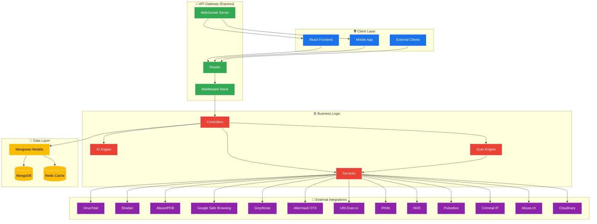
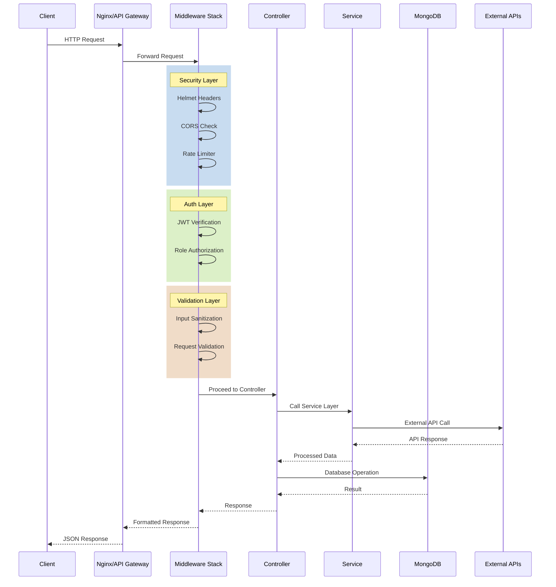
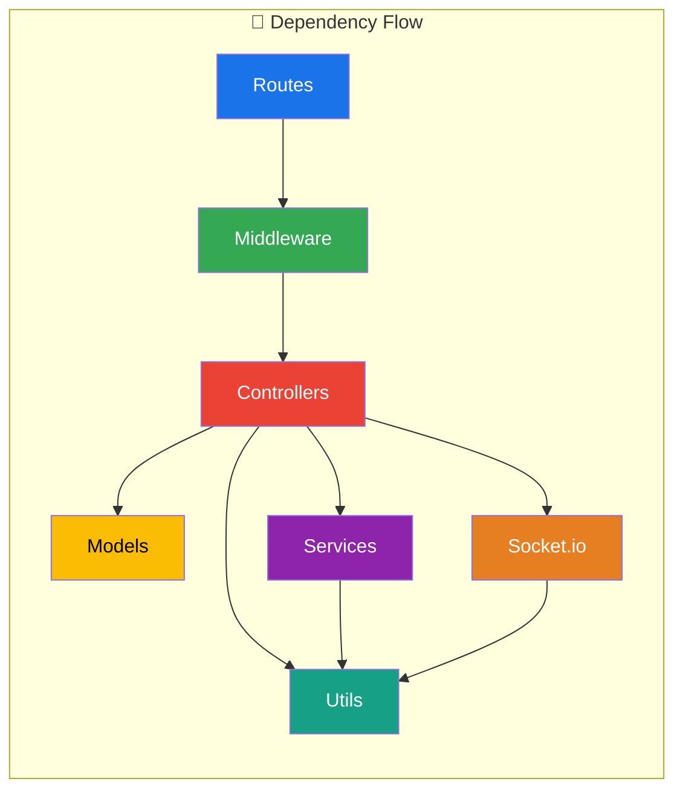
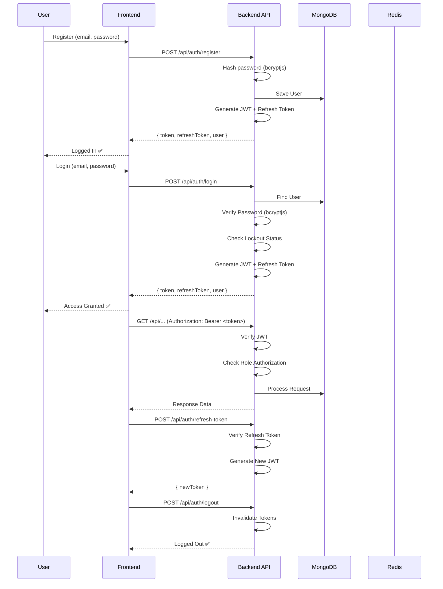
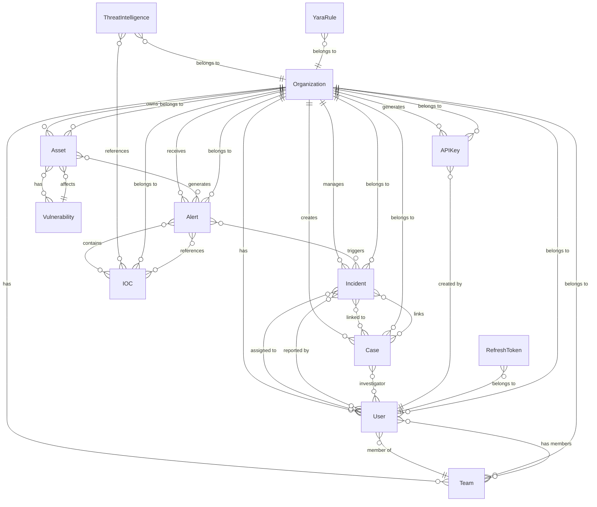
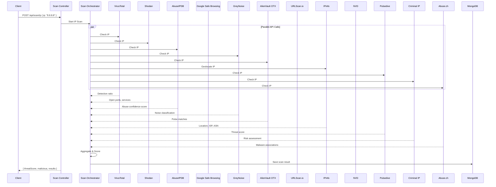

<p align="center">
  
</p>

<p align="center">
  
</p>

<p align="center">
  
  
  
  
  
  
  
</p>

<p align="center">
  
  
  
  
  
  
</p>

<br/>

<div align="center">
  
</div>

<br/>

---

# 🚀 SentinelX AI — Enterprise SOC Backend

> **AI-Powered Security Operations Center (SOC) Platform** — जहाँ सुरक्षा मिलती है आर्टिफिशियल इंटेलिजेंस से!  
> *"Next-Generation Threat Detection, Incident Response & Threat Intelligence Platform"*

<p align="center">
  
</p>

---

## 📋 Table of Contents

| # | Section | Description |
|---|---------|-------------|
| 1️⃣ | [✨ Features](#-features) | Key features & capabilities |
| 2️⃣ | [🏗️ Architecture](#️-architecture) | System architecture & design |
| 3️⃣ | [📁 Project Structure](#-project-structure) | Complete folder structure explained |
| 4️⃣ | [⚡ Tech Stack](#-tech-stack) | Technologies & libraries used |
| 5️⃣ | [🔐 Authentication Flow](#-authentication-flow) | JWT auth, refresh tokens, roles |
| 6️⃣ | [🗄️ Database Models](#️-database-models) | All 13 Mongoose models explained |
| 7️⃣ | [🛣️ API Routes](#️-api-routes) | All 12 route groups with endpoints |
| 8️⃣ | [🎮 Controllers](#-controllers) | Business logic layer explained |
| 9️⃣ | [🛡️ Middleware](#️-middleware) | Security & utility middleware |
| 🔟 | [🔗 External Services](#-external-services) | 13+ threat intelligence APIs |
| 1️⃣1️⃣ | [📡 WebSockets](#-websockets) | Real-time communication |
| 1️⃣2️⃣ | [🧠 AI Features](#-ai-features) | AI-powered analysis |
| 1️⃣3️⃣ | [🚀 Getting Started](#-getting-started) | Setup & installation guide |
| 1️⃣4️⃣ | [🐳 Docker Deployment](#-docker-deployment) | Docker setup |
| 1️⃣5️⃣ | [📊 API Documentation](#-api-documentation) | Swagger docs |
| 1️⃣6️⃣ | [🔧 Environment Variables](#-environment-variables) | Configuration reference |
| 1️⃣7️⃣ | [🤝 Contributing](#-contributing) | How to contribute |
| 1️⃣8️⃣ | [📄 License](#-license) | License info |

---

<p align="center">
  
</p>

## ✨ Features

<div align="center">
  
</div>

<br/>

<table>
  <tr>
    <td align="center" width="33%">
      <br/>
      <b>🔐 Auth & Authorization</b><br/>
      <sub>JWT with refresh tokens, RBAC (Admin, Analyst, Viewer, Operator), account lockout, MFA ready</sub>
    </td>
    <td align="center" width="33%">
      <br/>
      <b>🗄️ 13 Models</b><br/>
      <sub>User, Organization, Team, Asset, Alert, Incident, Case, IOC, Vulnerability, YARA, API Key, Refresh Token, Threat Intel</sub>
    </td>
    <td align="center" width="33%">
      <br/>
      <b>📡 Real-time</b><br/>
      <sub>Socket.io events for alerts, incidents, dashboard updates, case management, WebSocket rooms</sub>
    </td>
  </tr>
  <tr>
    <td align="center">
      <br/>
      <b>🧠 AI Analysis</b><br/>
      <sub>Mock AI service for threat analysis, report generation, risk scoring, chat Q&A, pattern detection</sub>
    </td>
    <td align="center">
      <br/>
      <b>🔗 13+ APIs</b><br/>
      <sub>VirusTotal, Shodan, AbuseIPDB, Google Safe Browsing, GreyNoise, OTX, URLScan, IPinfo, NVD, Pulsedive, Criminal IP, Abuse.ch, Cloudinary</sub>
    </td>
    <td align="center">
      <br/>
      <b>🛡️ Security</b><br/>
      <sub>Helmet, CORS, Rate Limiting, Input Sanitization, Request Validation, Error Handling, Advanced Logging</sub>
    </td>
  </tr>
  <tr>
    <td align="center">
      <br/>
      <b>📊 Dashboard</b><br/>
      <sub>Overview stats, attack timeline, risk score trends, compliance status, threat map, real-time analytics</sub>
    </td>
    <td align="center">
      <br/>
      <b>🎯 Scan Engine</b><br/>
      <sub>IP, URL, Domain, Hash, File scanning — orchestrate across all 13 threat intel APIs simultaneously</sub>
    </td>
    <td align="center">
      <br/>
      <b>🏢 Multi-Tenant</b><br/>
      <sub>Organization management, team management, subscription plans, user roles, hierarchical access control</sub>
    </td>
  </tr>
</table>

<br/>

<details>
<summary><b>📋 Complete Feature List (Click to Expand)</b></summary>
<br/>

| Category | Features |
|----------|----------|
| 🔐 **Authentication** | JWT access tokens, Refresh tokens, Password hashing (bcryptjs), Account lockout (5 attempts), Password reset flow, MFA ready, Cookie-based auth, Bearer token auth |
| 👥 **User Management** | CRUD operations, Role-based access (admin/analyst/viewer/operator), Team assignment, Status toggle (active/inactive), User preferences (theme, timezone, language, notifications), Last login tracking |
| 🏢 **Organization** | Multi-tenant architecture, Subscription plans, Organization stats, Team management, Hierarchical access |
| 💻 **Asset Management** | Full asset lifecycle, Hardware/software/network interfaces, Compliance tracking, Vulnerability scanning, Asset agents, Automatic discovery |
| 🚨 **Alert Management** | 30+ alert types, Severity levels (critical/high/medium/low/info), Priority levels, Status workflow (new→acknowledged→investigating→resolved→dismissed), IOC tracking, MITRE ATT&CK mapping, AI analysis integration |
| 🔥 **Incident Management** | Complete lifecycle (investigation→containment→eradication→recovery→lessons_learned), Artifact management with chain of custody, Financial impact tracking, Data breach notification, Timeline tracking |
| 📁 **Case Management** | Link multiple incidents, Evidence management, Chain of custody, Investigator assignment, Status tracking |
| 🧠 **Threat Intelligence** | Global IOCs, CVE vulnerability database, YARA rules, Threat actor tracking, Campaign tracking, Malware analysis |
| 🔍 **Scan Engine** | IP scanning, URL scanning, Domain scanning, Hash scanning, File scanning, Parallel API orchestration, Aggregated threat scoring |
| 🤖 **AI Analysis** | Threat analysis, Report generation, Risk scoring, Chat/Q&A, Pattern recognition, IOC extraction |
| 📡 **Real-time** | Socket.io events, Organization rooms, User rooms, Alert subscriptions, Incident subscriptions, Dashboard updates |
| 📊 **Dashboard** | Overview stats, Attack timeline, Risk score trends, Compliance status, Threat map, Real-time analytics |
| 🛡️ **Security** | Helmet headers, CORS configuration, Rate limiting, Input sanitization, Request validation, Error handling, Audit logging |
| 📝 **API Docs** | Swagger/OpenAPI 3.0, Interactive documentation, Try-it-out functionality |
| 🐳 **Docker** | Multi-container setup, MongoDB, Redis, Auto-restart, Volume persistence |

</details>

<br/>

<p align="center">
  
</p>

---

## 🏗️ Architecture

<p align="center">
  
</p>



### 📊 Request Flow Diagram



### 📁 Folder Dependency



---

## 📁 Project Structure

<p align="center">
  
</p>

```
📦 backend/
├── ⚡ server.js                     # 🚀 Entry Point - Express setup, middleware, routes
├── 📦 package.json                  # 📋 Dependencies & scripts
├── 🐳 Dockerfile                    # 🐳 Docker container config
├── 🐳 docker-compose.yml            # 🐳 Docker Compose (App + MongoDB + Redis)
├── ✅ TODO.md                       # 📝 Progress tracker
│
├── ⚙️ config/                       # 🔧 Configuration
│   ├── db.js                       #   🗄️ MongoDB connection (Mongoose)
│   └── swagger.js                  #   📚 Swagger/OpenAPI config
│
├── 🗄️ models/                       # 🏗️ Mongoose Schemas (13 files)
│   ├── User.js                     #   👤 User accounts, roles, auth
│   ├── Organization.js             #   🏢 Multi-tenant organizations
│   ├── Team.js                     #   👥 Teams within organizations
│   ├── Asset.js                    #   💻 Hardware/software assets
│   ├── Alert.js                    #   🚨 Security alerts
│   ├── Incident.js                 #   🔥 Security incidents
│   ├── Case.js                     #   📁 Investigation cases
│   ├── IOC.js                      #   🎯 Indicators of Compromise
│   ├── Vulnerability.js            #   🐛 CVE vulnerabilities
│   ├── ThreatIntelligence.js       #   🧠 Threat actors & malware
│   ├── YaraRule.js                 #   📜 YARA detection rules
│   ├── APIKey.js                   #   🔑 API keys
│   └── RefreshToken.js             #   🔄 Refresh token store
│
├── 🎮 controllers/                  # 🧠 Business Logic (12 files)
│   ├── authController.js           #   🔐 Auth (register, login, tokens)
│   ├── userController.js           #   👤 User CRUD, status
│   ├── organizationController.js   #   🏢 Organization CRUD
│   ├── teamController.js           #   👥 Team CRUD
│   ├── assetController.js          #   💻 Asset CRUD, scan
│   ├── alertController.js          #   🚨 Alert CRUD, workflow
│   ├── incidentController.js       #   🔥 Incident lifecycle
│   ├── caseController.js           #   📁 Case management
│   ├── threatController.js         #   🧠 Threat intel CRUD
│   ├── scanController.js           #   🔍 Scan orchestration
│   ├── aiController.js             #   🤖 AI analysis
│   └── dashboardController.js      #   📊 Dashboard analytics
│
├── 🛣️ routes/                       # 🚏 Route definitions (12 files)
│   ├── auth.js                     #   🔐 Auth routes
│   ├── users.js                    #   👤 User routes
│   ├── organizations.js            #   🏢 Organization routes
│   ├── teams.js                    #   👥 Team routes
│   ├── assets.js                   #   💻 Asset routes
│   ├── alerts.js                   #   🚨 Alert routes
│   ├── incidents.js                #   🔥 Incident routes
│   ├── cases.js                    #   📁 Case routes
│   ├── threats.js                  #   🧠 Threat intel routes
│   ├── scanRoutes.js               #   🔍 Scan routes
│   ├── dashboard.js                #   📊 Dashboard routes
│   └── ai.js                       #   🤖 AI routes
│
├── 🛡️ middleware/                   # 🔒 Security & utility (7 files)
│   ├── auth.js                     #   🔐 JWT protection, role auth
│   ├── async.js                    #   ⚡ Async error wrapper
│   ├── advancedResults.js          #   📊 Pagination, filter, sort
│   ├── errorHandler.js             #   🚨 Global error handler
│   ├── notFound.js                 #   ❌ 404 handler
│   ├── rateLimiter.js              #   ⏱️ Rate limiting
│   ├── sanitize.js                 #   🧹 Input sanitization
│   └── validate.js                 #   ✅ Request validation
│
├── 🔗 services/                     # 🌐 External API integrations (13 files)
│   ├── virusTotalService.js        #   🦠 VirusTotal v3
│   ├── abuseIpService.js           #   🚫 AbuseIPDB
│   ├── googleSafeBrowsingService.js #   🛡️ Google Safe Browsing
│   ├── shodanService.js            #   🔍 Shodan
│   ├── urlscanService.js           #   🔗 URLScan.io
│   ├── otxService.js               #   👽 AlienVault OTX
│   ├── greyNoiseService.js         #   🌫️ GreyNoise
│   ├── ipinfoService.js            #   🌐 IPinfo
│   ├── nvdService.js               #   📋 NVD (CVE Database)
│   ├── abusechService.js           #   🦊 Abuse.ch (ThreatFox + MalwareBazaar)
│   ├── pulsediveService.js         #   🎯 Pulsedive
│   ├── criminalIpService.js        #   ⚠️ Criminal IP
│   └── cloudinaryService.js        #   ☁️ Cloudinary upload
│
├── 📡 sockets/                      # 🔌 WebSocket (1 file)
│   └── index.js                    #   📡 Socket.io with JWT auth
│
├── 🛠️ utils/                        # 🧰 Utilities
│   ├── errorResponse.js            #   🚨 Custom error class
│   ├── logger.js                   #   📝 Winston logger
│   ├── sendEmail.js                #   📧 Nodemailer
│   ├── socketEvents.js             #   📡 Socket event emitters
│   └── validators/                 #   ✅ Validation schemas
│       ├── auth/                   #   🔐 Auth validators
│       ├── users/                  #   👤 User validators
│       ├── assets/                 #   💻 Asset validators
│       ├── alerts/                 #   🚨 Alert validators
│       ├── incidents/              #   🔥 Incident validators
│       ├── cases/                  #   📁 Case validators
│       └── threats/                #   🧠 Threat validators
│
├── 📜 scripts/                      # 📦 Scripts
│   └── seed.js                    #   🌱 Database seeder
│
└── 📝 logs/                         # 📄 Logs (auto-generated)
    ├── application-YYYY-MM-DD.log  #   📋 Daily logs
    └── *-audit.json               #   🔍 Audit logs
```

---

## ⚡ Tech Stack

<p align="center">
  
</p>

<div align="center">
  
</div>

<br/>

### 🎯 Core Technologies

<table>
  <tr>
    <th>Technology</th>
    <th>Version</th>
    <th>Purpose</th>
    <th>Badge</th>
  </tr>
  <tr>
    <td>🟢 Node.js</td>
    <td>≥ 16.0</td>
    <td>JavaScript runtime — server-side execution</td>
    <td></td>
  </tr>
  <tr>
    <td>⚡ Express.js</td>
    <td>4.18.x</td>
    <td>Web framework — routing, middleware, HTTP</td>
    <td></td>
  </tr>
  <tr>
    <td>🍃 MongoDB</td>
    <td>5.x</td>
    <td>NoSQL database — document storage</td>
    <td></td>
  </tr>
  <tr>
    <td>🔴 Redis</td>
    <td>7.x</td>
    <td>In-memory cache — performance & session store</td>
    <td></td>
  </tr>
</table>

### 📚 Core Libraries

<details>
<summary><b>Click to see all 30+ libraries</b></summary>
<br/>

| Library | Version | Category | Purpose |
|---------|---------|----------|---------|
| 🍃 **mongoose** | ^7.8.11 | ODM | MongoDB schema modeling, validation, population |
| 🔐 **jsonwebtoken** | latest | Auth | JWT generation & verification |
| 🔒 **bcryptjs** | ^2.4.3 | Auth | Password hashing & comparison |
| 📡 **socket.io** | ^4.7.2 | Real-time | WebSocket server for real-time events |
| 🌐 **axios** | ^1.18.1 | HTTP | HTTP client for external API calls |
| ☁️ **cloudinary** | ^2.10.0 | Upload | File upload to Cloudinary |
| 🗜️ **compression** | ^1.8.1 | Performance | Gzip compression for responses |
| 🍪 **cookie-parser** | ^1.4.7 | Utility | Parse cookies from requests |
| 🔗 **cors** | ^2.8.5 | Security | Cross-Origin Resource Sharing |
| 🌱 **dotenv** | ^16.3.1 | Config | Environment variable loading |
| 📧 **nodemailer** | ^6.9.3 | Email | Email sending (Gmail OAuth2/SMTP) |
| 🔒 **helmet** | ^7.0.0 | Security | HTTP security headers |
| 📋 **morgan** | ^1.11.0 | Logging | HTTP request logging |
| 📤 **multer** | ^2.2.0 | Upload | Multipart form data handling |
| 📝 **winston** | ^3.10.0 | Logging | Advanced logging with rotation |
| 📚 **swagger-jsdoc** | ^6.3.0 | Docs | Swagger/OpenAPI spec generation |
| 📚 **swagger-ui-express** | ^5.0.0 | Docs | Swagger UI serving |
| ✅ **joi** | ^17.9.2 | Validation | Request validation schemas |
| 📊 **handlebars** | ^4.7.7 | Templates | Email templates |
| ⏰ **moment** | ^2.29.4 | Dates | Date manipulation |
| 🗄️ **redis** | ^4.6.7 | Cache | Redis client for caching |
| 🎯 **yamljs** | ^0.3.0 | Config | YAML parsing |
| 🧪 **jest** | ^29.6.2 | Testing | Unit/integration testing |
| 🔄 **nodemon** | ^3.0.1 | Dev | Auto-restart during development |
| 🧪 **supertest** | ^6.3.3 | Testing | HTTP assertion testing |

</details>

---

## 🔐 Authentication Flow

<p align="center">
  
</p>



### 🔑 Role-Based Access Control

<table>
  <tr>
    <th>Role</th>
    <th>Permissions</th>
    <th>Badge</th>
  </tr>
  <tr>
    <td align="center">👑 <b>Admin</b></td>
    <td>Full access — manage users, orgs, settings, all data</td>
    <td></td>
  </tr>
  <tr>
    <td align="center">🔍 <b>Analyst</b></td>
    <td>Read/Write — create alerts, incidents, cases, view dashboards</td>
    <td></td>
  </tr>
  <tr>
    <td align="center">👁️ <b>Viewer</b></td>
    <td>Read-only — view dashboards, alerts, reports</td>
    <td></td>
  </tr>
  <tr>
    <td align="center">⚙️ <b>Operator</b></td>
    <td>Limited — manage assets, acknowledge alerts, basic ops</td>
    <td></td>
  </tr>
</table>

### 🔐 Security Features

| Feature | Implementation | File |
|---------|---------------|------|
| 🔑 **JWT Access Tokens** | `jsonwebtoken` with configurable expiry | `middleware/auth.js` |
| 🔄 **Refresh Tokens** | Separate JWT with longer expiry, stored in DB | `models/RefreshToken.js` |
| 🔒 **Password Hashing** | `bcryptjs` with salt rounds (10) | `models/User.js` |
| 🚫 **Account Lockout** | 5 failed attempts → 30 min lock | `models/User.js` |
| 🎭 **Role Authorization** | `authorize()` middleware for role checking | `middleware/auth.js` |
| 🍪 **Cookie Support** | Token can be sent via cookies | `middleware/auth.js` |
| 📧 **Password Reset** | Crypto token with 1-hour expiry | `models/User.js` |
| 🔐 **MFA Ready** | Multi-factor authentication field ready | `models/User.js` |

---

## 🗄️ Database Models

<p align="center">
  
</p>

<div align="center">
  
</div>

<br/>

### 🔗 Entity Relationship Diagram



### 📋 Model Details

<details>
<summary><b>👤 User Model — Click to Expand</b></summary>
<br/>

**File:** `models/User.js`

| Field | Type | Required | Default | Description |
|-------|------|----------|---------|-------------|
| `firstName` | String | ✅ | - | User's first name |
| `lastName` | String | ✅ | - | User's last name |
| `email` | String | ✅ | - | Unique email (lowercase, validated) |
| `password` | String | ✅ | - | Min 8 chars, hashed with bcrypt |
| `role` | Enum | - | `viewer` | `admin`, `analyst`, `viewer`, `operator` |
| `organization` | ObjectId | ✅ | - | Reference to Organization |
| `team` | ObjectId | - | - | Reference to Team |
| `isActive` | Boolean | - | `true` | Account active status |
| `lastLogin` | Date | - | - | Last login timestamp |
| `failedLoginAttempts` | Number | - | `0` | Failed login counter |
| `lockedUntil` | Date | - | - | Lockout expiry time |
| `mfaEnabled` | Boolean | - | `false` | MFA status |
| `preferences.theme` | Enum | - | `dark` | `light`, `dark`, `system` |
| `preferences.timezone` | String | - | `UTC` | User timezone |
| `preferences.language` | String | - | `en` | Language preference |
| `preferences.emailNotifications` | Boolean | - | `true` | Email notification toggle |
| `preferences.browserNotifications` | Boolean | - | `true` | Browser notification toggle |
| `preferences.dashboardRefreshInterval` | Number | - | `30` | Refresh interval in seconds |

**Methods:**
- `matchPassword(password)` — Compare password with hash
- `getSignedJwtToken()` — Generate JWT access token
- `getRefreshToken()` — Generate refresh token
- `getPublicProfile()` — Get user without password
- `isLocked()` — Check if account is locked
- `incrementLoginAttempts()` — Increment failed attempts, lock after 5
- `resetLoginAttempts()` — Reset failed attempts
- `getResetPasswordToken()` — Generate password reset token

</details>

<details>
<summary><b>🏢 Organization Model — Click to Expand</b></summary>
<br/>

**File:** `models/Organization.js`

| Field | Type | Required | Default | Description |
|-------|------|----------|---------|-------------|
| `name` | String | ✅ | - | Organization name |
| `slug` | String | ✅ | - | URL-friendly unique identifier |
| `email` | String | - | - | Organization email |
| `phone` | String | - | - | Phone number |
| `address` | Object | - | - | Street, city, state, zip, country |
| `website` | String | - | - | Website URL |
| `industry` | String | - | - | Industry type |
| `size` | Enum | - | `small` | `small`, `medium`, `large`, `enterprise` |
| `subscription.plan` | Enum | - | `free` | `free`, `starter`, `professional`, `enterprise` |
| `subscription.status` | Enum | - | `active` | `active`, `inactive`, `suspended`, `cancelled` |
| `subscription.expiresAt` | Date | - | - | Subscription expiry |
| `isActive` | Boolean | - | `true` | Organization status |
| `settings` | Object | - | - | SSO, retention, notification settings |

</details>

<details>
<summary><b>🚨 Alert Model — Click to Expand</b></summary>
<br/>

**File:** `models/Alert.js`

| Field | Type | Required | Default | Description |
|-------|------|----------|---------|-------------|
| `title` | String | ✅ | - | Alert title |
| `description` | String | ✅ | - | Detailed description |
| `type` | Enum | ✅ | - | 30+ types (malware, phishing, DDoS, etc.) |
| `severity` | Enum | ✅ | - | `critical`, `high`, `medium`, `low`, `info` |
| `priority` | Enum | - | `medium` | `critical`, `high`, `medium`, `low` |
| `status` | Enum | - | `new` | `new`, `acknowledged`, `investigating`, `resolved`, `dismissed` |
| `source` | String | - | - | Alert source (SIEM, EDR, etc.) |
| `sourceIp` | String | - | - | Source IP address |
| `destinationIp` | String | - | - | Destination IP address |
| `sourcePort` | Number | - | - | Source port |
| `destinationPort` | Number | - | - | Destination port |
| `protocol` | String | - | - | Network protocol |
| `user` | ObjectId | - | - | Associated user |
| `asset` | ObjectId | - | - | Affected asset |
| `incident` | ObjectId | - | - | Linked incident |
| `iocs` | [ObjectId] | - | - | Linked IOCs |
| `mitreAttack` | [Object] | - | - | MITRE ATT&CK tactics & techniques |
| `aiAnalysis` | Object | - | - | AI analysis results |
| `rawLog` | String | - | - | Raw log data |
| `metadata` | Object | - | - | Additional metadata |
| `acknowledgedBy` | ObjectId | - | - | Who acknowledged |
| `acknowledgedAt` | Date | - | - | When acknowledged |
| `resolvedBy` | ObjectId | - | - | Who resolved |
| `resolvedAt` | Date | - | - | When resolved |
| `resolution` | String | - | - | Resolution notes |

</details>

<details>
<summary><b>🔥 Incident Model — Click to Expand</b></summary>
<br/>

**File:** `models/Incident.js`

| Field | Type | Required | Default | Description |
|-------|------|----------|---------|-------------|
| `title` | String | ✅ | - | Incident title |
| `description` | String | ✅ | - | Detailed description |
| `severity` | Enum | ✅ | - | `critical`, `high`, `medium`, `low` |
| `status` | Enum | - | `investigation` | `investigation`, `containment`, `eradication`, `recovery`, `lessons_learned`, `closed` |
| `incidentType` | Enum | ✅ | - | `malware`, `phishing`, `ransomware`, `data_breach`, `dos`, `insider_threat`, `unauthorized_access`, `policy_violation`, `social_engineering`, `physical_security`, `other` |
| `organization` | ObjectId | ✅ | - | Organization reference |
| `assignedTo` | ObjectId | - | - | Assigned user |
| `reportedBy` | ObjectId | ✅ | - | Reporting user |
| `alerts` | [ObjectId] | - | - | Related alerts |
| `assets` | [ObjectId] | - | - | Affected assets |
| `artifacts` | [Object] | - | - | Evidence with chain of custody |
| `timeline` | [Object] | - | - | Event timeline |
| `impact` | Object | - | - | Financial, data, system, reputational impact |
| `breachNotification` | Object | - | - | Data breach notification details |
| `lessons` | Object | - | - | Lessons learned |
| `containmentSteps` | [String] | - | - | Containment actions |
| `eradicationSteps` | [String] | - | - | Eradication actions |
| `recoverySteps` | [String] | - | - | Recovery actions |
| `rootCause` | String | - | - | Root cause analysis |
| `closedAt` | Date | - | - | Closure timestamp |

</details>

<details>
<summary><b>📁 Case Model — Click to Expand</b></summary>
<br/>

**File:** `models/Case.js`

| Field | Type | Required | Default | Description |
|-------|------|----------|---------|-------------|
| `caseId` | String | ✅ | - | Auto-generated case number |
| `title` | String | ✅ | - | Case title |
| `description` | String | ✅ | - | Case description |
| `status` | Enum | - | `open` | `open`, `investigating`, `pending`, `closed` |
| `priority` | Enum | - | `medium` | `critical`, `high`, `medium`, `low` |
| `organization` | ObjectId | ✅ | - | Organization reference |
| `incidents` | [ObjectId] | - | - | Linked incidents |
| `investigator` | ObjectId | - | - | Assigned investigator |
| `evidence` | [Object] | - | - | Evidence with chain of custody |
| `findings` | [Object] | - | - | Investigation findings |
| `conclusion` | String | - | - | Case conclusion |
| `closedAt` | Date | - | - | Closure timestamp |

</details>

<details>
<summary><b>🎯 IOC Model — Click to Expand</b></summary>
<br/>

**File:** `models/IOC.js`

| Field | Type | Required | Default | Description |
|-------|------|----------|---------|-------------|
| `value` | String | ✅ | - | IOC value (IP, URL, hash, domain) |
| `type` | Enum | ✅ | - | `ip`, `url`, `domain`, `md5`, `sha1`, `sha256`, `email`, `registry_key`, `file_path`, `mutex` |
| `threatType` | Enum | - | - | `malware`, `phishing`, `c2`, `scanner`, `exploit`, `botnet`, `ransomware`, `apt` |
| `confidence` | Number | - | `50` | 0-100 confidence score |
| `severity` | Enum | - | `medium` | `critical`, `high`, `medium`, `low`, `info` |
| `source` | String | - | - | Source of IOC |
| `firstSeen` | Date | - | - | First seen timestamp |
| `lastSeen` | Date | - | - | Last seen timestamp |
| `tags` | [String] | - | - | Tags for categorization |
| `description` | String | - | - | IOC description |
| `organization` | ObjectId | - | - | Organization reference |
| `isActive` | Boolean | - | `true` | Active status |

</details>

<details>
<summary><b>🐛 Vulnerability Model — Click to Expand</b></summary>
<br/>

**File:** `models/Vulnerability.js`

| Field | Type | Required | Default | Description |
|-------|------|----------|---------|-------------|
| `cveId` | String | ✅ | - | CVE identifier (e.g., CVE-2024-1234) |
| `title` | String | ✅ | - | Vulnerability title |
| `description` | String | ✅ | - | Detailed description |
| `severity` | Enum | - | - | `critical`, `high`, `medium`, `low` |
| `cvssScore` | Number | - | - | CVSS 3.1 score (0-10) |
| `cvssVector` | String | - | - | CVSS vector string |
| `cwe` | [String] | - | - | CWE identifiers |
| `affectedVersions` | [String] | - | - | Affected software versions |
| `fixedVersions` | [String] | - | - | Fixed versions |
| `references` | [String] | - | - | Reference URLs |
| `exploitAvailable` | Boolean | - | `false` | Exploit availability |
| `publishedDate` | Date | - | - | Publication date |
| `lastModifiedDate` | Date | - | - | Last modified date |
| `tags` | [String] | - | - | Tags |
| `organization` | ObjectId | - | - | Organization reference |

</details>

<details>
<summary><b>🧠 ThreatIntelligence Model — Click to Expand</b></summary>
<br/>

**File:** `models/ThreatIntelligence.js`

| Field | Type | Required | Default | Description |
|-------|------|----------|---------|-------------|
| `name` | String | ✅ | - | Threat actor/campaign name |
| `type` | Enum | ✅ | - | `actor`, `campaign`, `malware`, `tool`, `technique` |
| `aliases` | [String] | - | - | Known aliases |
| `description` | String | ✅ | - | Detailed description |
| `motivation` | [String] | - | - | Motivations (financial, espionage, hacktivism, etc.) |
| `targetedSectors` | [String] | - | - | Targeted industry sectors |
| `targetedGeographies` | [String] | - | - | Targeted countries/regions |
| `iocs` | [ObjectId] | - | - | Associated IOCs |
| `ttps` | [Object] | - | - | MITRE ATT&CK TTPs |
| `associatedGroups` | [String] | - | - | Related groups |
| `firstSeen` | Date | - | - | First observed |
| `lastSeen` | Date | - | - | Last observed |
| `confidence` | Number | - | `50` | Confidence level (0-100) |
| `source` | String | - | - | Source of intelligence |
| `organization` | ObjectId | - | - | Organization reference |
| `isActive` | Boolean | - | `true` | Active status |

</details>

<details>
<summary><b>📜 YaraRule Model — Click to Expand</b></summary>
<br/>

**File:** `models/YaraRule.js`

| Field | Type | Required | Default | Description |
|-------|------|----------|---------|-------------|
| `name` | String | ✅ | - | Rule name |
| `description` | String | ✅ | - | Rule description |
| `author` | String | - | - | Rule author |
| `rule` | String | ✅ | - | Raw YARA rule content |
| `tags` | [String] | - | - | Tags |
| `references` | [String] | - | - | Reference URLs |
| `severity` | Enum | - | `medium` | `critical`, `high`, `medium`, `low`, `info` |
| `category` | String | - | - | Rule category |
| `isActive` | Boolean | - | `true` | Active status |
| `version` | Number | - | `1` | Rule version |
| `metadata` | Object | - | - | Additional metadata |
| `organization` | ObjectId | - | - | Organization reference |

</details>

<details>
<summary><b>🔑 APIKey & RefreshToken Models — Click to Expand</b></summary>
<br/>

**APIKey** (`models/APIKey.js`)

| Field | Type | Description |
|-------|------|-------------|
| `name` | String | Key name |
| `key` | String | Hashed API key |
| `organization` | ObjectId | Organization reference |
| `createdBy` | ObjectId | User who created it |
| `permissions` | [String] | Allowed permissions |
| `isActive` | Boolean | Active status |
| `lastUsed` | Date | Last usage timestamp |
| `expiresAt` | Date | Expiry date |

**RefreshToken** (`models/RefreshToken.js`)

| Field | Type | Description |
|-------|------|-------------|
| `token` | String | Hashed refresh token |
| `user` | ObjectId | User reference |
| `expiresAt` | Date | Token expiry |
| `isRevoked` | Boolean | Revocation status |
| `revokedAt` | Date | Revocation timestamp |
| `userAgent` | String | Client user agent |
| `ipAddress` | String | Client IP address |

</details>

---

## 🛣️ API Routes

<p align="center">
  
</p>

<div align="center">
  
</div>

<br/>

### 🔐 Authentication Routes — `/api/auth`

| Method | Endpoint | Description | Auth | Roles |
|--------|----------|-------------|------|-------|
| 📝 `POST` | `/register` | Register new user + organization | ❌ | All |
| 🔑 `POST` | `/login` | Login user | ❌ | All |
| 🚪 `POST` | `/logout` | Logout & invalidate tokens | ✅ | All |
| 🔄 `POST` | `/refresh-token` | Refresh JWT access token | ❌ | All |
| 👤 `GET` | `/me` | Get current user profile | ✅ | All |
| ✏️ `PUT` | `/updatedetails` | Update user details | ✅ | All |
| 🔒 `PUT` | `/updatepassword` | Update password | ✅ | All |
| 📧 `POST` | `/forgotpassword` | Send password reset email | ❌ | All |
| 🔐 `PUT` | `/resetpassword/:token` | Reset password with token | ❌ | All |

### 👤 User Routes — `/api/users`

| Method | Endpoint | Description | Roles |
|--------|----------|-------------|-------|
| 📋 `GET` | `/` | Get all users (paginated) | Admin |
| ➕ `POST` | `/` | Create user | Admin |
| 🔍 `GET` | `/:id` | Get single user | Admin, Analyst |
| ✏️ `PUT` | `/:id` | Update user | Admin |
| ❌ `DELETE` | `/:id` | Delete user | Admin |
| 🔄 `PUT` | `/:id/toggle-status` | Toggle user active status | Admin |

### 🏢 Organization Routes — `/api/organizations`

| Method | Endpoint | Description | Roles |
|--------|----------|-------------|-------|
| 📋 `GET` | `/` | Get all organizations | Admin |
| ➕ `POST` | `/` | Create organization | Admin |
| 🔍 `GET` | `/:id` | Get single organization | Admin |
| ✏️ `PUT` | `/:id` | Update organization | Admin |
| ❌ `DELETE` | `/:id` | Delete organization | Admin |
| 📊 `GET` | `/:id/stats` | Get organization stats | Admin, Analyst |

### 👥 Team Routes — `/api/teams`

| Method | Endpoint | Description | Roles |
|--------|----------|-------------|-------|
| 📋 `GET` | `/` | Get all teams | Admin, Analyst |
| ➕ `POST` | `/` | Create team | Admin |
| 🔍 `GET` | `/:id` | Get single team | Admin, Analyst |
| ✏️ `PUT` | `/:id` | Update team | Admin |
| ❌ `DELETE` | `/:id` | Delete team | Admin |
| 👥 `PUT` | `/:id/members` | Update team members | Admin |
| 👑 `PUT` | `/:id/lead` | Set team lead | Admin |

### 💻 Asset Routes — `/api/assets`

| Method | Endpoint | Description | Roles |
|--------|----------|-------------|-------|
| 📋 `GET` | `/` | Get all assets | All |
| ➕ `POST` | `/` | Create asset | Admin, Analyst, Operator |
| 🔍 `GET` | `/:id` | Get single asset | All |
| ✏️ `PUT` | `/:id` | Update asset | Admin, Analyst, Operator |
| ❌ `DELETE` | `/:id` | Delete asset | Admin |
| 📊 `GET` | `/:id/stats` | Get asset stats | All |
| 🔍 `POST` | `/:id/scan` | Scan asset | Admin, Analyst |
| 📋 `GET` | `/type/:type` | Get assets by type | All |
| 💻 `GET` | `/agent/config` | Get agent configuration | Admin, Analyst |

### 🚨 Alert Routes — `/api/alerts`

| Method | Endpoint | Description | Roles |
|--------|----------|-------------|-------|
| 📋 `GET` | `/` | Get all alerts | All |
| ➕ `POST` | `/` | Create alert | Admin, Analyst |
| 🔍 `GET` | `/:id` | Get single alert | All |
| ✏️ `PUT` | `/:id` | Update alert | Admin, Analyst |
| ❌ `DELETE` | `/:id` | Delete alert | Admin |
| ✅ `PUT` | `/:id/acknowledge` | Acknowledge alert | Admin, Analyst, Operator |
| 🔒 `PUT` | `/:id/resolve` | Resolve alert | Admin, Analyst |
| 📊 `GET` | `/stats/main` | Get alert statistics | All |

### 🔥 Incident Routes — `/api/incidents`

| Method | Endpoint | Description | Roles |
|--------|----------|-------------|-------|
| 📋 `GET` | `/` | Get all incidents | All |
| ➕ `POST` | `/` | Create incident | Admin, Analyst |
| 🔍 `GET` | `/:id` | Get single incident | All |
| ✏️ `PUT` | `/:id` | Update incident | Admin, Analyst |
| ❌ `DELETE` | `/:id` | Delete incident | Admin |
| 📊 `GET` | `/stats/main` | Get incident statistics | All |
| ➕ `POST` | `/:id/artifacts` | Add artifact to incident | Admin, Analyst |
| ❌ `DELETE` | `/:id/artifacts/:artifactId` | Remove artifact | Admin, Analyst |
| 🔄 `PUT` | `/:id/status` | Update incident status | Admin, Analyst |
| 👤 `PUT` | `/:id/assign` | Assign incident to user | Admin, Analyst |
| 🎯 `POST` | `/:id/actions` | Record incident action | Admin, Analyst |

### 📁 Case Routes — `/api/cases`

| Method | Endpoint | Description | Roles |
|--------|----------|-------------|-------|
| 📋 `GET` | `/` | Get all cases | All |
| ➕ `POST` | `/` | Create case | Admin, Analyst |
| 🔍 `GET` | `/:id` | Get single case | All |
| ✏️ `PUT` | `/:id` | Update case | Admin, Analyst |
| ❌ `DELETE` | `/:id` | Delete case | Admin |
| 📄 `POST` | `/:id/evidence` | Add evidence | Admin, Analyst |
| ❌ `DELETE` | `/:id/evidence/:evidenceId` | Remove evidence | Admin, Analyst |
| 👤 `PUT` | `/:id/investigator` | Assign investigator | Admin |
| 📊 `GET` | `/stats/main` | Get case statistics | All |

### 🧠 Threat Routes — `/api/threats`

| Method | Endpoint | Description | Roles |
|--------|----------|-------------|-------|
| 📋 `GET` | `/iocs` | Get all IOCs | All |
| ➕ `POST` | `/iocs` | Create IOC | Admin, Analyst |
| 📋 `GET` | `/vulnerabilities` | Get all vulnerabilities | All |
| ➕ `POST` | `/vulnerabilities` | Create vulnerability | Admin, Analyst |
| 📋 `GET` | `/yara-rules` | Get all YARA rules | All |
| ➕ `POST` | `/yara-rules` | Create YARA rule | Admin, Analyst |
| 📋 `GET` | `/threats` | Get all threat intelligence | All |
| ➕ `POST` | `/threats` | Create threat intelligence | Admin, Analyst |

### 🔍 Scan Routes — `/api/scan`

| Method | Endpoint | Description | Roles |
|--------|----------|-------------|-------|
| 🌐 `POST` | `/ip` | Scan IP address | All |
| 🔗 `POST` | `/url` | Scan URL | All |
| 🌍 `POST` | `/domain` | Scan domain | All |
| 🔑 `POST` | `/hash` | Scan file hash | All |
| 📁 `POST` | `/file` | Scan file (upload) | All |

### 📊 Dashboard Routes — `/api/dashboard`

| Method | Endpoint | Description | Roles |
|--------|----------|-------------|-------|
| 📊 `GET` | `/overview` | Dashboard overview stats | All |
| 📈 `GET` | `/timeline` | Attack timeline data | All |
| 🗺️ `GET` | `/threat-map` | Threat map data | All |
| 📉 `GET` | `/risk-trends` | Risk score trends | All |
| ✅ `GET` | `/compliance` | Compliance status | All |

### 🤖 AI Routes — `/api/ai`

| Method | Endpoint | Description | Roles |
|--------|----------|-------------|-------|
| 🧠 `POST` | `/analyze` | Analyze threat data | Admin, Analyst |
| 📄 `POST` | `/report` | Generate report | Admin, Analyst |
| 📊 `POST` | `/risk-score` | Calculate risk score | Admin, Analyst |
| 💬 `POST` | `/chat` | AI chat/Q&A | All |

---

## 🎮 Controllers

<p align="center">
  
</p>

<div align="center">
  
</div>

<br/>

Each controller handles the business logic for its respective domain. Here's what each one does:

| Controller | File | Key Functions | Description |
|------------|------|---------------|-------------|
| 🔐 **Auth** | `authController.js` | `register`, `login`, `logout`, `refreshToken`, `getMe`, `updateDetails`, `updatePassword`, `forgotPassword`, `resetPassword` | User authentication, token management, password reset |
| 👤 **User** | `userController.js` | `getUsers`, `createUser`, `getUser`, `updateUser`, `deleteUser`, `toggleUserStatus` | User CRUD with admin controls |
| 🏢 **Organization** | `organizationController.js` | `getOrganizations`, `createOrganization`, `getOrganization`, `updateOrganization`, `deleteOrganization`, `getOrganizationStats` | Multi-tenant org management |
| 👥 **Team** | `teamController.js` | `getTeams`, `createTeam`, `getTeam`, `updateTeam`, `deleteTeam`, `updateTeamMembers`, `setTeamLead` | Team management with member assignment |
| 💻 **Asset** | `assetController.js` | `getAssets`, `createAsset`, `getAsset`, `updateAsset`, `deleteAsset`, `getAssetStats`, `scanAsset`, `getAssetsByType`, `getAgentConfig` | Asset lifecycle management |
| 🚨 **Alert** | `alertController.js` | `getAlerts`, `createAlert`, `getAlert`, `updateAlert`, `deleteAlert`, `acknowledgeAlert`, `resolveAlert`, `getAlertStats` | Alert workflow management |
| 🔥 **Incident** | `incidentController.js` | `getIncidents`, `createIncident`, `getIncident`, `updateIncident`, `deleteIncident`, `getIncidentStats`, `addArtifact`, `removeArtifact`, `updateStatus`, `assignIncident`, `recordAction` | Full incident lifecycle |
| 📁 **Case** | `caseController.js` | `getCases`, `createCase`, `getCase`, `updateCase`, `deleteCase`, `addEvidence`, `removeEvidence`, `assignInvestigator`, `getCaseStats` | Investigation case management |
| 🧠 **Threat** | `threatController.js` | CRUD for IOCs, Vulnerabilities, YARA Rules, Threat Intelligence | Threat intel data management |
| 🔍 **Scan** | `scanController.js` | `scanIP`, `scanURL`, `scanDomain`, `scanHash`, `scanFile` | Orchestrate scans across all 13 APIs |
| 🤖 **AI** | `aiController.js` | `analyzeThreat`, `generateReport`, `calculateRiskScore`, `chat` | Mock AI analysis engine |
| 📊 **Dashboard** | `dashboardController.js` | `getOverview`, `getTimeline`, `getThreatMap`, `getRiskTrends`, `getCompliance` | Dashboard analytics |

---

## 🛡️ Middleware

<p align="center">
  
</p>

<div align="center">
  
</div>

<br/>

### 🔐 Auth Middleware — `auth.js`

```javascript
// Protect routes — JWT verification
exports.protect
// Role-based access control
exports.authorize('admin', 'analyst')
```

**How it works:**
1. Extracts JWT from `Authorization: Bearer <token>` header or cookies
2. Verifies token with `JWT_SECRET`
3. Fetches user from database
4. Attaches `req.user` for downstream use
5. `authorize()` checks if user's role is in allowed roles

### ⚡ Async Error Wrapper — `async.js`

```javascript
const asyncHandler = fn => (req, res, next) =>
  Promise.resolve(fn(req, res, next)).catch(next);
```

Wraps all async route handlers to catch errors and pass to error handler — no more `try/catch` blocks!

### 📊 Advanced Results — `advancedResults.js`

**Features:**
- 🔍 **Search**: Regex search across multiple fields (name, title, description, email, etc.)
- 📋 **Pagination**: `?page=1&limit=25` with next/prev links
- 🔄 **Sorting**: `?sort=-createdAt` (any field, `-` for descending)
- 🎯 **Filtering**: `?severity=critical&status=new` (auto MongoDB operators)
- ✂️ **Field Selection**: `?select=name,email,role`
- 🔗 **Population**: Auto-populate referenced documents

### 🚨 Error Handler — `errorHandler.js`

```javascript
// Global error handling middleware
// Handles: Validation errors, Cast errors, Duplicate keys, JWT errors, Custom errors
```

Handles all error types:
- Mongoose `ValidationError` → 400
- Mongoose `CastError` (invalid ObjectId) → 400
- MongoDB duplicate key error (11000) → 400
- JWT `JsonWebTokenError` → 401
- JWT `TokenExpiredError` → 401
- Custom `ErrorResponse` → 400-500
- Unknown errors → 500

### ⏱️ Rate Limiter — `rateLimiter.js`

```javascript
// Default: 100 requests per 15 minutes per IP
rateLimiter(windowMs = 15 * 60 * 1000, maxRequests = 100)
```

**Features:**
- In-memory request tracking per IP
- Configurable window & max requests
- Rate limit headers (`X-RateLimit-Limit`, `X-RateLimit-Remaining`, `X-RateLimit-Reset`)
- `Retry-After` header on limit exceeded
- Auto-cleanup of old entries

### 🧹 Sanitize — `sanitize.js`

```javascript
// Prevents NoSQL injection & XSS attacks
// Removes $ and . from request body, query, params
```

### ✅ Validate — `validate.js`

```javascript
// Factory function for Joi validation schemas
validate(schema, property = 'body')
```

### ❌ Not Found — `notFound.js`

```javascript
// 404 handler for unknown routes
// Returns: { success: false, error: 'Route not found' }
```

---

## 🔗 External Services

<p align="center">
  
</p>

<div align="center">
  
</div>

<br/>

<table>
  <tr>
    <th>#</th>
    <th>Service</th>
    <th>File</th>
    <th>Purpose</th>
    <th>Badge</th>
  </tr>
  <tr>
    <td>1️⃣</td>
    <td>🦠 <b>VirusTotal</b></td>
    <td><code>virusTotalService.js</code></td>
    <td>File/URL/IP hash lookup — 70+ antivirus engines</td>
    <td></td>
  </tr>
  <tr>
    <td>2️⃣</td>
    <td>🔍 <b>Shodan</b></td>
    <td><code>shodanService.js</code></td>
    <td>Device/service discovery, open ports, banners</td>
    <td></td>
  </tr>
  <tr>
    <td>3️⃣</td>
    <td>🚫 <b>AbuseIPDB</b></td>
    <td><code>abuseIpService.js</code></td>
    <td>IP reputation — abuse reports, confidence score</td>
    <td></td>
  </tr>
  <tr>
    <td>4️⃣</td>
    <td>🛡️ <b>Google Safe Browsing</b></td>
    <td><code>googleSafeBrowsingService.js</code></td>
    <td>URL/domain — malware, phishing, unwanted software</td>
    <td></td>
  </tr>
  <tr>
    <td>5️⃣</td>
    <td>🌫️ <b>GreyNoise</b></td>
    <td><code>greyNoiseService.js</code></td>
    <td>IP — benign internet noise vs. targeted threats</td>
    <td></td>
  </tr>
  <tr>
    <td>6️⃣</td>
    <td>👽 <b>AlienVault OTX</b></td>
    <td><code>otxService.js</code></td>
    <td>Open Threat Exchange — IOCs, pulses, threat intel</td>
    <td></td>
  </tr>
  <tr>
    <td>7️⃣</td>
    <td>🔗 <b>URLScan.io</b></td>
    <td><code>urlscanService.js</code></td>
    <td>URL scanning — screenshot, DOM, requests, resources</td>
    <td></td>
  </tr>
  <tr>
    <td>8️⃣</td>
    <td>🌐 <b>IPinfo</b></td>
    <td><code>ipinfoService.js</code></td>
    <td>IP geolocation, ASN, ISP, organization data</td>
    <td></td>
  </tr>
  <tr>
    <td>9️⃣</td>
    <td>📋 <b>NVD (CVE Database)</b></td>
    <td><code>nvdService.js</code></td>
    <td>National Vulnerability Database — CVE details, CVSS scores</td>
    <td></td>
  </tr>
  <tr>
    <td>🔟</td>
    <td>🦊 <b>Abuse.ch</b></td>
    <td><code>abusechService.js</code></td>
    <td>ThreatFox + MalwareBazaar — malware samples, IOCs</td>
    <td></td>
  </tr>
  <tr>
    <td>1️⃣1️⃣</td>
    <td>🎯 <b>Pulsedive</b></td>
    <td><code>pulsediveService.js</code></td>
    <td>Threat intelligence — IOCs, threat scores, feeds</td>
    <td></td>
  </tr>
  <tr>
    <td>1️⃣2️⃣</td>
    <td>⚠️ <b>Criminal IP</b></td>
    <td><code>criminalIpService.js</code></td>
    <td>IP/domain threat intelligence, risk scoring</td>
    <td></td>
  </tr>
  <tr>
    <td>1️⃣3️⃣</td>
    <td>☁️ <b>Cloudinary</b></td>
    <td><code>cloudinaryService.js</code></td>
    <td>File upload, image optimization, CDN delivery</td>
    <td></td>
  </tr>
</table>

### 🔍 Scan Engine Flow



---

## 📡 WebSockets

<p align="center">
  
</p>

<div align="center">
  
</div>

<br/>

**File:** `sockets/index.js` | **Events:** `utils/socketEvents.js`

### 🔌 Socket.io Setup

```javascript
// Socket.io with JWT authentication middleware
io.use(async (socket, next) => {
  const token = socket.handshake.auth.token;
  const decoded = jwt.verify(token, process.env.JWT_SECRET);
  const user = await User.findById(decoded.id);
  socket.user = user;
  socket.organizationId = user.organization.toString();
  next();
});
```

### 📡 Events Overview

| Event | Direction | Description |
|-------|-----------|-------------|
| 🔌 `connection` | Client → Server | User connects with JWT auth |
| 🔌 `disconnect` | Client → Server | User disconnects |
| 🏠 `join-room` | Client → Server | Join specific room (incident, alert) |
| 🚪 `leave-room` | Client → Server | Leave a room |
| 🚨 `subscribe-alerts` | Client → Server | Subscribe to org alerts |
| 🔥 `subscribe-incidents` | Client → Server | Subscribe to org incidents |
| 📊 `subscribe-dashboard` | Client → Server | Subscribe to dashboard updates |

### 📡 Server Events (Emitters)

| Function | Event | Target | Description |
|----------|-------|--------|-------------|
| `emitToUser(userId, event, data)` | Custom | User room | Send to specific user |
| `emitToOrg(orgId, event, data)` | Custom | Org room | Send to entire organization |
| `emitAlertEvent(orgId, event, data)` | `alertCreated`, `alertUpdated`, `alertResolved` | Alerts room | Alert notifications |
| `emitIncidentEvent(orgId, event, data)` | `incidentCreated`, `incidentUpdated` | Incidents room | Incident notifications |
| `emitDashboardEvent(orgId, event, data)` | Custom | Dashboard room | Dashboard updates |

### 🏠 Room Architecture

```
User connects → JWT Auth → Organization Room: org_<id>
                          → User Room: user_<id>
                          → Can join: alerts_org_<id>
                          → Can join: incidents_org_<id>
                          → Can join: dashboard_org_<id>
                          → Can join: custom rooms
```

---

## 🧠 AI Features

<p align="center">
  
</p>

<div align="center">
  
</div>

<br/>

**File:** `controllers/aiController.js`

The AI controller provides mock AI services for security analysis:

| Feature | Endpoint | Description |
|---------|----------|-------------|
| 🧠 **Threat Analysis** | `POST /api/ai/analyze` | Analyze threat data, extract IOCs, predict impact |
| 📄 **Report Generation** | `POST /api/ai/report` | Generate security reports with findings |
| 📊 **Risk Scoring** | `POST /api/ai/risk-score` | Calculate risk score based on CVSS, severity, context |
| 💬 **Chat Q&A** | `POST /api/ai/chat` | Interactive Q&A about security threats |

**Analysis Output Includes:**
- Threat classification & severity
- IOC extraction & enrichment
- MITRE ATT&CK mapping
- Risk score calculation
- Remediation recommendations
- Historical context & trends
- Confidence scoring

---

## 🚀 Getting Started

<p align="center">
  
</p>

<div align="center">
  
</div>

<br/>

### 📋 Prerequisites

- **Node.js** ≥ 16.0
- **MongoDB** 5.x (local or Atlas)
- **Redis** 7.x (optional, for caching)
- **npm** or **yarn**

### ⚡ Quick Start

```bash
# 1️⃣ Clone the repository
git clone https://github.com/yourusername/sentinelx-ai.git
cd sentinelx-ai/backend

# 2️⃣ Install dependencies
npm install

# 3️⃣ Create environment file
cp .env.example .env

# 4️⃣ Edit .env with your configuration
#    - MongoDB URI
#    - JWT secrets
#    - External API keys (optional)

# 5️⃣ Start development server
npm run dev

# 6️⃣ Seed database with sample data
npm run seed
```

### 📦 One-Click Setup

```bash
npm install && cp .env.example .env && npm run dev
```

### 🌱 Database Seeding

```bash
# Seed with sample data
npm run seed

# Destroy all seeded data
npm run seed:destroy
```

### 🧪 Testing

```bash
# Run all tests
npm test

# Run with coverage
npx jest --coverage
```

---

## 🐳 Docker Deployment

<p align="center">
  
</p>

<div align="center">
  
</div>

<br/>

### 🐳 Docker Compose (Production)

```yaml
services:
  app:          # Node.js backend
    build: .
    ports: ["5000:5000"]
    depends_on: [mongodb, redis]
  mongodb:      # MongoDB 5.x
    image: mongo:5
    ports: ["27017:27017"]
  redis:        # Redis 7.x cache
    image: redis:7-alpine
    ports: ["6379:6379"]
```

### 🚀 Run with Docker

```bash
# Build and start all services
docker-compose up --build -d

# View logs
docker-compose logs -f app

# Stop all services
docker-compose down

# Stop and remove volumes
docker-compose down -v
```

### 🐳 Dockerfile

```dockerfile
FROM node:18-alpine
WORKDIR /usr/src/app
COPY package*.json ./
RUN npm ci --only=production
COPY . .
EXPOSE 5000
ENV NODE_ENV=production
CMD ["npm", "start"]
```

---

## 📊 API Documentation

<p align="center">
  
</p>

<div align="center">
  
</div>

<br/>

Interactive API documentation is available at **`/api-docs`** when the server is running.

**Swagger Configuration:**
- **OpenAPI**: 3.0.0
- **Title**: SentinelX AI API
- **Auth**: Bearer JWT
- **Server**: `http://localhost:5000/api`
- **Specs**: Auto-generated from JSDoc comments in route files

### 📋 Response Format

**Success Response:**
```json
{
  "success": true,
  "count": 25,
  "pagination": {
    "next": { "page": 2, "limit": 25 },
    "prev": null
  },
  "data": [...]
}
```

**Error Response:**
```json
{
  "success": false,
  "error": "Error message here"
}
```

---

## 🔧 Environment Variables

<p align="center">
  
</p>

<div align="center">
  
</div>

<br/>

<table>
  <tr>
    <th>Variable</th>
    <th>Required</th>
    <th>Default</th>
    <th>Description</th>
  </tr>
  <tr>
    <td colspan="4" align="center"><b>🔧 Server Configuration</b></td>
  </tr>
  <tr><td><code>PORT</code></td><td>❌</td><td><code>5001</code></td><td>Server port</td></tr>
  <tr><td><code>NODE_ENV</code></td><td>❌</td><td><code>development</code></td><td>Environment mode</td></tr>
  <tr><td><code>BASE_URL</code></td><td>❌</td><td><code>http://localhost:5000/api</code></td><td>Base URL for Swagger</td></tr>
  <tr><td><code>CLIENT_URL</code></td><td>❌</td><td><code>http://localhost:3000</code></td><td>Frontend URL for CORS</td></tr>
  <tr>
    <td colspan="4" align="center"><b>🗄️ Database</b></td>
  </tr>
  <tr><td><code>MONGO_URI</code></td><td>✅</td><td>-</td><td>MongoDB connection string</td></tr>
  <tr><td><code>REDIS_URL</code></td><td>❌</td><td>-</td><td>Redis connection string</td></tr>
  <tr>
    <td colspan="4" align="center"><b>🔐 Authentication</b></td>
  </tr>
  <tr><td><code>JWT_SECRET</code></td><td>✅</td><td>-</td><td>JWT signing secret</td></tr>
  <tr><td><code>JWT_EXPIRE</code></td><td>❌</td><td><code>30d</code></td><td>JWT expiry time</td></tr>
  <tr><td><code>JWT_REFRESH_SECRET</code></td><td>✅</td><td>-</td><td>Refresh token secret</td></tr>
  <tr><td><code>JWT_REFRESH_EXPIRE</code></td><td>❌</td><td><code>30d</code></td><td>Refresh token expiry</td></tr>
  <tr><td><code>JWT_COOKIE_EXPIRE</code></td><td>❌</td><td><code>30</code></td><td>Cookie expiry (days)</td></tr>
  <tr>
    <td colspan="4" align="center"><b>📧 Email</b></td>
  </tr>
  <tr><td><code>SMTP_HOST</code></td><td>❌</td><td>-</td><td>SMTP server host</td></tr>
  <tr><td><code>SMTP_PORT</code></td><td>❌</td><td><code>587</code></td><td>SMTP server port</td></tr>
  <tr><td><code>SMTP_USER</code></td><td>❌</td><td>-</td><td>SMTP username</td></tr>
  <tr><td><code>SMTP_PASS</code></td><td>❌</td><td>-</td><td>SMTP password</td></tr>
  <tr><td><code>FROM_EMAIL</code></td><td>❌</td><td>-</td><td>Sender email address</td></tr>
  <tr><td><code>FROM_NAME</code></td><td>❌</td><td><code>SentinelX AI</code></td><td>Sender name</td></tr>
  <tr>
    <td colspan="4" align="center"><b>🔗 External APIs</b></td>
  </tr>
  <tr><td><code>VIRUSTOTAL_API_KEY</code></td><td>❌</td><td>-</td><td>VirusTotal API key</td></tr>
  <tr><td><code>SHODAN_API_KEY</code></td><td>❌</td><td>-</td><td>Shodan API key</td></tr>
  <tr><td><code>ABUSEIPDB_API_KEY</code></td><td>❌</td><td>-</td><td>AbuseIPDB API key</td></tr>
  <tr><td><code>GOOGLE_SAFE_BROWSING_API_KEY</code></td><td>❌</td><td>-</td><td>Google Safe Browsing key</td></tr>
  <tr><td><code>GREYNOISE_API_KEY</code></td><td>❌</td><td>-</td><td>GreyNoise API key</td></tr>
  <tr><td><code>OTX_API_KEY</code></td><td>❌</td><td>-</td><td>AlienVault OTX key</td></tr>
  <tr><td><code>URLSCAN_API_KEY</code></td><td>❌</td><td>-</td><td>URLScan.io API key</td></tr>
  <tr><td><code>IPINFO_API_KEY</code></td><td>❌</td><td>-</td><td>IPinfo API key</td></tr>
  <tr><td><code>NVD_API_KEY</code></td><td>❌</td><td>-</td><td>NVD API key</td></tr>
  <tr><td><code>ABUSECH_API_KEY</code></td><td>❌</td><td>-</td><td>Abuse.ch API key</td></tr>
  <tr><td><code>PULSEDIVE_API_KEY</code></td><td>❌</td><td>-</td><td>Pulsedive API key</td></tr>
  <tr><td><code>CRIMINALIP_API_KEY</code></td><td>❌</td><td>-</td><td>Criminal IP API key</td></tr>
  <tr><td><code>CLOUDINARY_CLOUD_NAME</code></td><td>❌</td><td>-</td><td>Cloudinary cloud name</td></tr>
  <tr><td><code>CLOUDINARY_API_KEY</code></td><td>❌</td><td>-</td><td>Cloudinary API key</td></tr>
  <tr><td><code>CLOUDINARY_API_SECRET</code></td><td>❌</td><td>-</td><td>Cloudinary API secret</td></tr>
</table>

---

## 🤝 Contributing

<p align="center">
  
</p>

<div align="center">
  
</div>

<br/>

We welcome contributions! Here's how you can help:

1. 🍴 **Fork** the repository
2. 🌿 **Create** a feature branch (`git checkout -b feature/amazing-feature`)
3. 💻 **Commit** your changes (`git commit -m 'Add amazing feature'`)
4. 📤 **Push** to the branch (`git push origin feature/amazing-feature`)
5. 🔄 **Open** a Pull Request

### 📋 Development Guidelines

```bash
# Code style
npm run lint

# Run tests
npm test

# Build
npm run build
```

---

## 📄 License

<p align="center">
  
</p>

This project is licensed under the **MIT License** — see the [LICENSE](LICENSE) file for details.

---

<p align="center">
  
</p>

<p align="center">
  <b>Made with ❤️ by the SentinelX AI Team</b><br/>
  <sub>🔒 Securing the digital world, one API at a time 🔒</sub>
</p>

<p align="center">
  <a href="https://github.com/yourusername/sentinelx-ai">
    
  </a>
  <a href="https://twitter.com/yourusername">
    
  </a>
  <a href="mailto:contact@sentinelx.ai">
    
  </a>
</p>

<p align="center">
  
</p>
